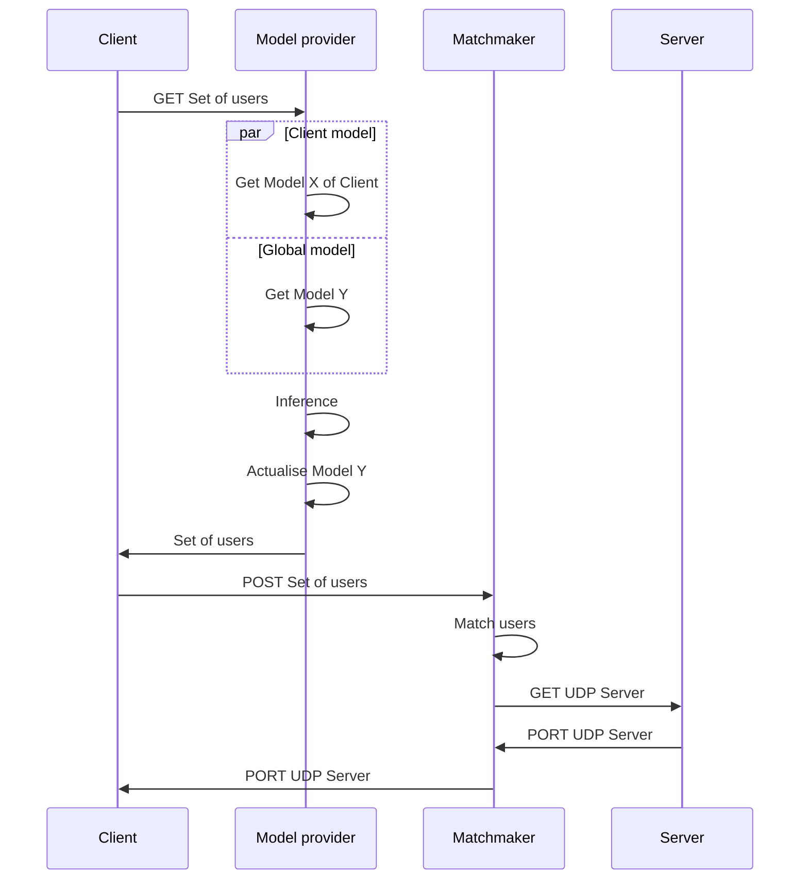
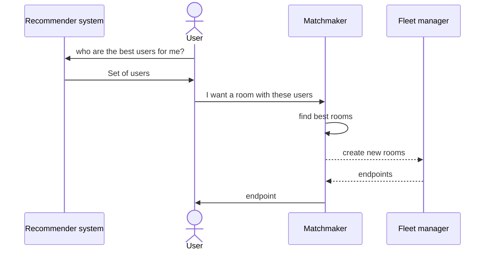
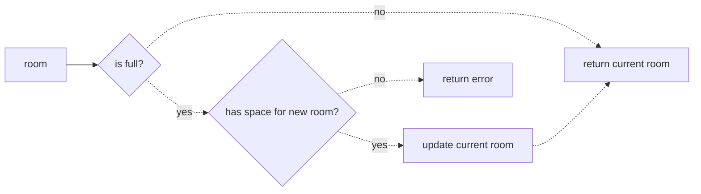
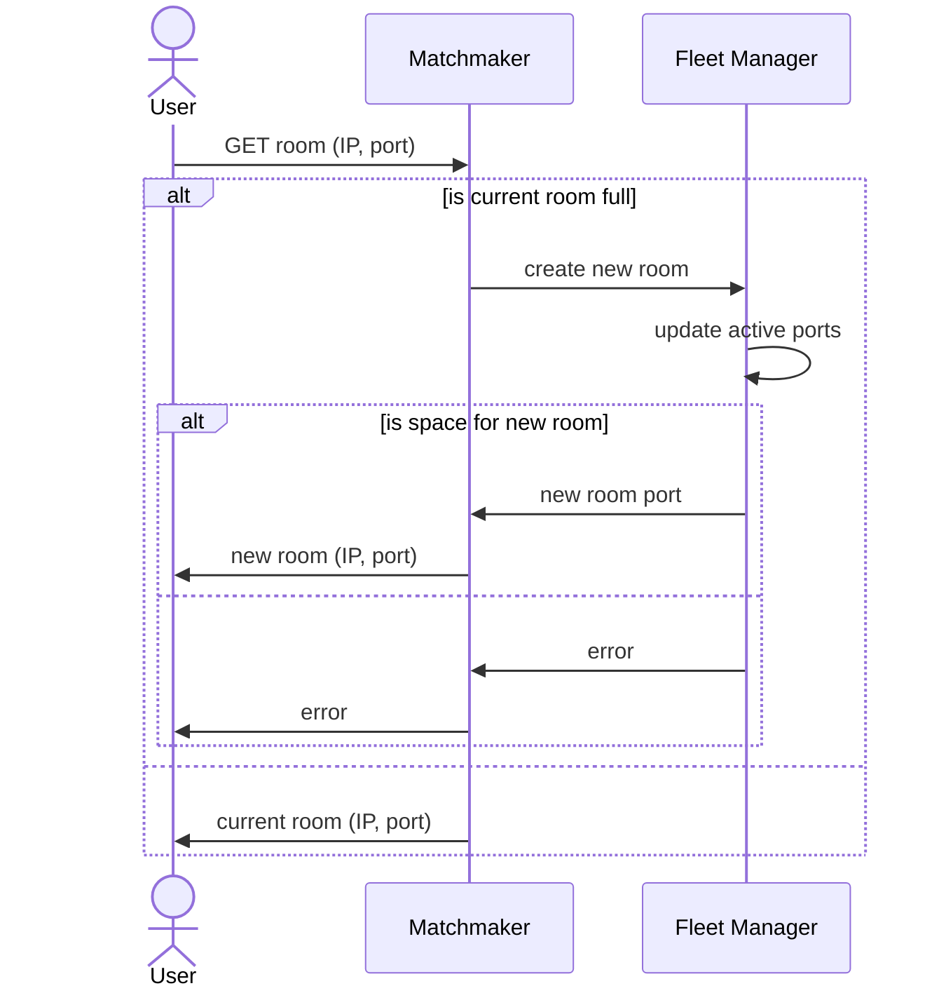
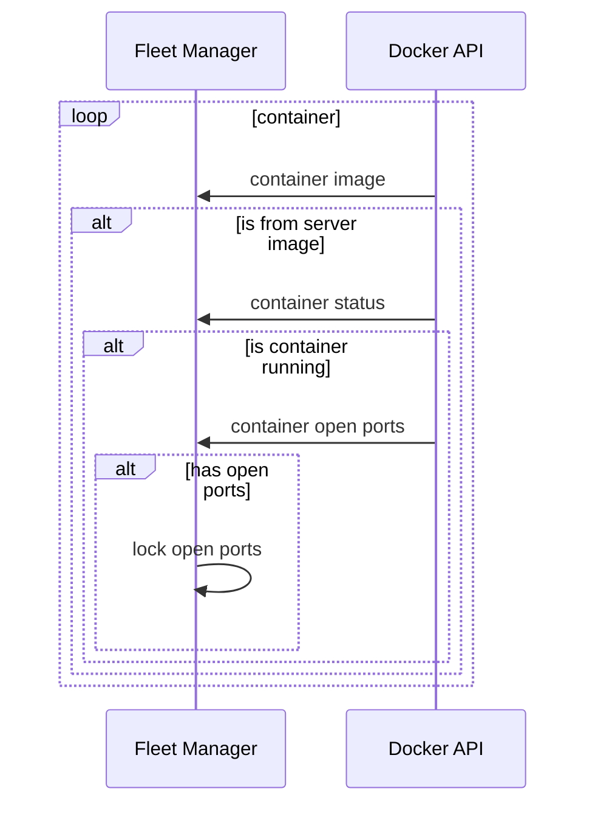

# super-duper-guacamole

### Note on Godot

Using **Godot** for a simple chat may *not be the best idea*. Indeed, **Godot** is really useful when it comes to *real-time 2D* and *real-time 3D*. Using a standard technology (*ReactNative*) would be more appropriate here.

### Note on Flutter

**Flutter** is quicker to setup than **React Native** *(I mean, literally quicker, it doesn't burn my laptop)*. I've used (Flutter Chat UI)[https://pub.dev/packages/flutter_chat_ui] to get a first chat without coding. *The same framework was available with **React Native***

# Codebase

```sh
# macOS: brew install cloc
>> cloc --exclude-ext=md .  
     266 text files.
     120 unique files.                                          
     400 files ignored.

github.com/AlDanial/cloc v 1.92  T=0.15 s (781.9 files/s, 57922.8 lines/s)
-----------------------------------------------------------------------------------
Language                         files          blank        comment           code
-----------------------------------------------------------------------------------
XML                                 39              7             45           3089
C/C++ Header                        26            348           1937            773
JSON                                11              1              0            603
C++                                  5             81             29            317
CMake                                4             34             30            167
Bourne Shell                         3             24             26            155
Dart                                 4             34             23            152
Bourne Again Shell                   1             19             20            121
YAML                                 4             26             82            109
Gradle                               3             19              3             88
HTML                                 1              9             15             80
Windows Resource File                1             23             29             69
DOS Batch                            1             24              2             64
JavaScript                           4             10              5             61
Markdown                             1              6              0             26
Objective-C                          3              6              4             21
Java                                 1              3              5             16
Swift                                1              1              0             12
Ruby                                 1              1              6             11
Properties                           3              0              1             10
Kotlin                               1              2              0              4
D                                    2              0              0              2
-----------------------------------------------------------------------------------
SUM:                               120            678           2262           5950
-----------------------------------------------------------------------------------
```

# Architecture

## Sequence Diagram

### Distributed


In a **distributed architecture**, the code that infers the correct set of users belongs to the **client app**. Thus, it uses the client technologies: Godot and GDScript.

### Centralised



In a **centralised architecture**, the code that infers the correct set of users belongs to the **cloud**. Thus, it uses whatever languages.

> We will first choose the **centralised architecture** to use state-of-the-art libraries in Machine Learning with **Python**. However, we'll keep the code as close as possible to a **decentralised** version, so we will be able to switch later on. The objective is to verify as quickly as possible that the model works.

## Cloud

### Centralised


> `Federated` architecture will simply remove the **_client models_ database**

### Note on information flow





> Will user who likes the same worlds will like eachothers? Will it work with few worlds?

# How room are managed?

## User ask for a room



## Fleet manager update active ports



---

# How to run your server?

**The following only concerns world that works over UDP. Do not use the following instruction if your world uses WebRTC.**

## Export your Godot server

1. Open your project in **Godot**
2. Go to *Project* > *Export...*
3. If there is no export pre-defined for **Server Linux/X11** *(or whatever export name you want, just keep it consistent)*
    1. Click *Add...* > *Linux/X11*
    2. Click the **Folder icon** next to *Export path*
    3. Click the **Up arrow** in the upper right to *go to parent folder*
    4. Select *exports* > *linux*
    5. Enter **server** in *File input* *(or whatever filename you whant, but you'll have to editing the Dockerfile accordingly)*
    6. Enter **Server Linux/X11** in *Name input*
4. Select **Server Linux/X11** if not already selected
5. Click *Export PCK/Zip*
6. Enter **server** in *File input* if it is not pre-entered *(or whatever filename you whant, but you'll have to editing the Dockerfile accordingly)*
7. Select *Godot Game Pack (\*.pck)* as extension
8. Uncheck *Export With Debug*
9. Click *Save*

Well done! You now have your server exported under *exports/linux/server.pck*.

## Create your Docker image

1. Open your terminal and verify that Docker is installed (type `docker --version`), if not, follow instruction at [Get Docker](https://docs.docker.com/get-docker/)
2. In your terminal, go to your working directory *super-duper-guacamole*
3. If you changed the name of your exported file
    1. Open *Dockerfile*
    2. On line `27`, edit the path accordingly
4. Run `docker build -t awa-server .`

Well done! You now have your docker image built. Run `docker images` to see it.

## Test your Docker image

1. Open your terminal with Docker installed, and go to your working directory *super-duper-guacamole*
2. Verify that your image exists with `docker images`
3. Run you image with `docker run -dp 8080:8080/udp awa-server`
4. Verify that your container is running with `docker ps`
5. Open a new terminal and go to your working directory *super-duper-guacamole/awa-chat*
6. Run `godot`
7. Your client is now open, verify that everything behave correctly

Well done! You now have an image that can run a container correctly.

> **Tips:** you can look at the *logs* of your container with `docker logs <CONTAINER ID>`, you'll find your *CONTAINER ID* with `docker ps`

> **Tips:** you can stop and remove your container with `docker rm -f <CONTAINER ID>`

## Export your Docker image to DockerHub

1. Sign up or sign in to [DockerHub](https://hub.docker.com/)
2. Click the *Create Repository* button
3. Name it *awa-server*, and add the description you want
4. Click the *Create* button
5. Open your terminal with Docker installed, and go to your working directory *super-duper-guacamole*
6. Tag your image with the correct name with `docker tag awa-server <YOUR USERNAME>/awa-server` *(find the correct username under the Docker commands section on your DockerHub image page)
7. Login to you DockerHub account with `docker login -u <YOUR USERNAME>`
8. Push your image to DockerHub with `docker push <YOUR USERNAME>/awa-server`

Well done! You now have your image ready to deploy to the web easily

## Run you image on an AWS Lightsail instance from DockerHub

1. Sign up or sign in to [AWS Console](https://signin.aws.amazon.com/signin)
2. Type *Lightsail* in the search bar and click the *Lightsail* button
3. If you have no instance running
    1. Click the *Create instance* button
    2. Select *Linux/Unix* and *OS Only* > *Amazon Linux 2*
    3. Add *Launch script* below to install Docker on your instance
    4. *[Optional]* Change your SSH key pair
    5. Choose your instance plan
    6. Give a name to your instance
    7. Click the *Create instance* button
4. Select your instance, and go to the *Networking* tab
5. Under *IPv4 Firewall* click the *+ Add Rule* button
6. Select *Application* > *Custom*, *Protocol* > *UDP*, and set the correct port range *(8080 in the original code)*
7. *[Optional]* Restrict to the IP addresses that will use your server if you know them *(best security practice)*
8. Go to the *Connect* tab, and click the *Connect using SSH* button
9. Verify that Docker is correctly installed with `docker --version`
11. Run your image with `docker run -dp 8080:8080/udp <YOUR USERNAME>/awa-server`
    1. If the port `8080` is already used on your machine, you can use any other port, just replace the command with `docker run -dp <YOUR PORT>:8080/udp <YOUR USERNAME>/awa-server`, and don't forget to open it in the `Networking` tab

Well done! You now have a running container of your server in the Web.

> **Tips**: Plans $3.5, $5, and $10 offer 3 months free.

### Launch script

```sh
sudo yum update -y
sudo amazon-linux-extras install docker
sudo yum install docker
sudo service docker start
sudo systemctl enable docker
sudo usermod -a -G docker ec2-user
```

## Test your online container

1. Go to your AWS Account > Lightsail, and select your instance
2. Go to the *Networking* tab
3. If your instance doesn't have a *Public IP*, attach one
4. Copy your *Public IP*
5. Open your terminal, and go to your working directory *super-duper-guacamole/awa-chat*
6. Run `godot`, and connect to your online container
7. Verify that everything works as expected

Well done! You now have a working server that you can connect to anywhere in the world.

# How to export your Godot project for iOS?

Follow the instruction at [Export for iOS](https://docs.godotengine.org/en/stable/tutorials/export/exporting_for_ios.html)

> *App Store Team ID and Bundler on your Apple profile* *Design the required icons with 72, 120 and 1024 size*

# How to export your Godot project for Android?

Follow the instruction at [Export for Android](https://docs.godotengine.org/en/stable/tutorials/export/exporting_for_android.html)
