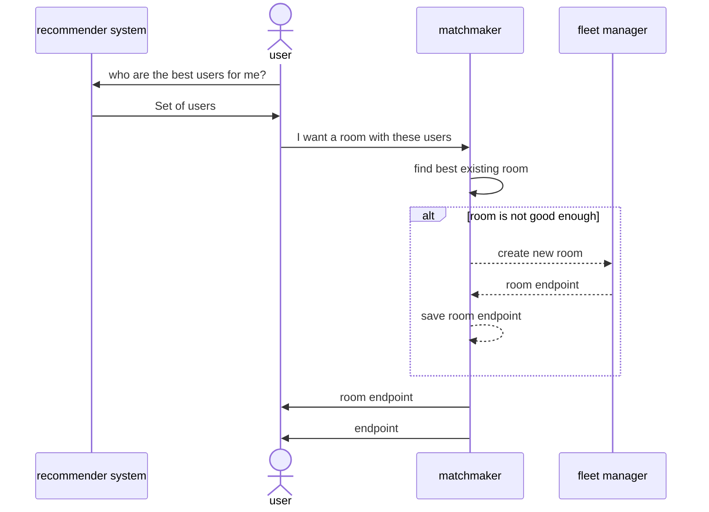
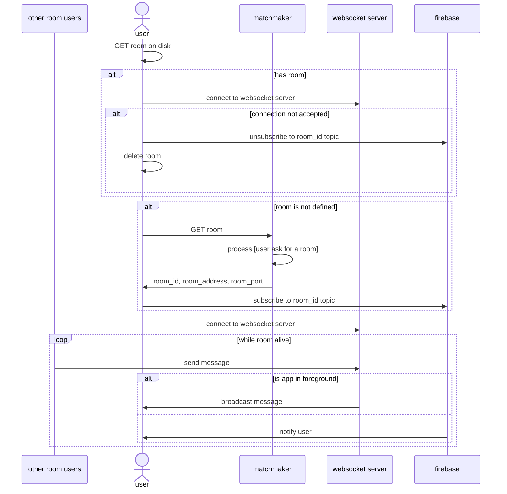
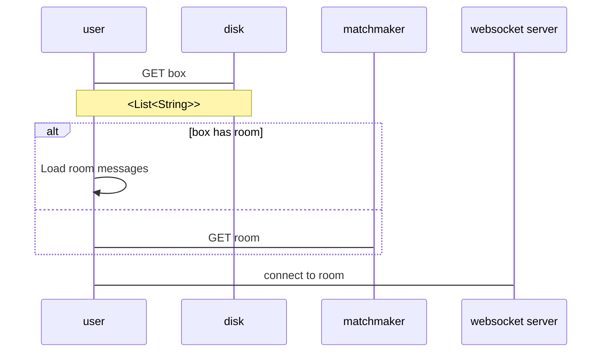
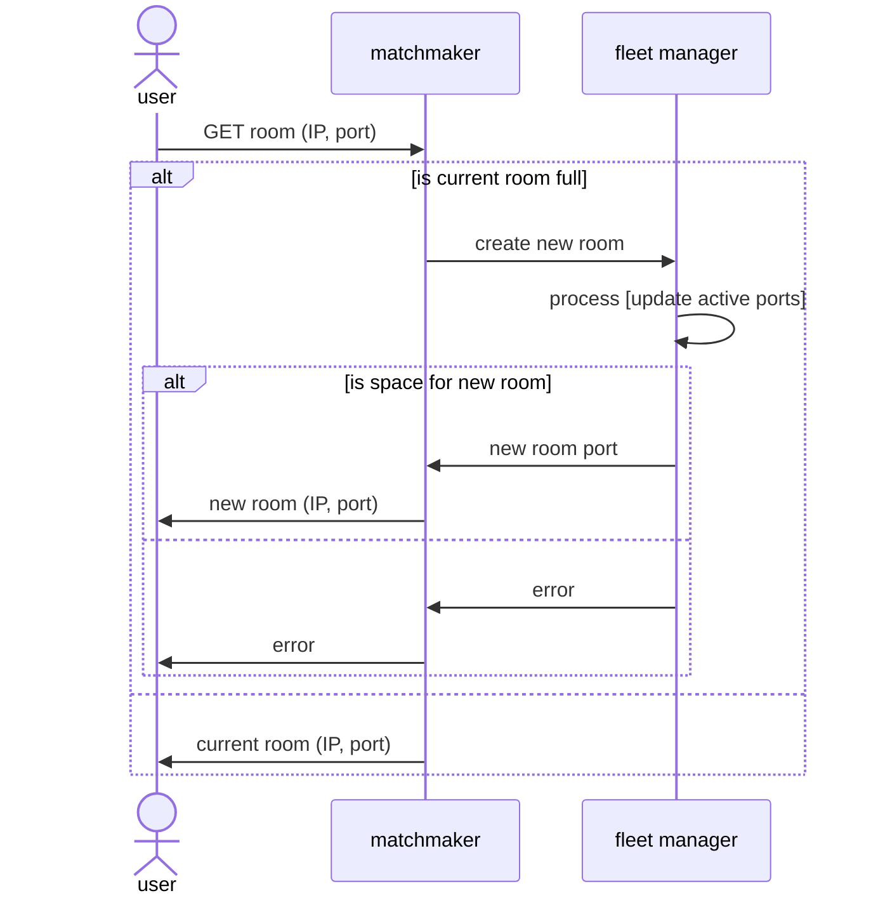
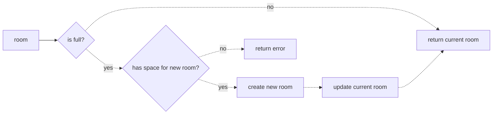

# super-duper-guacamole

# Cloud Architecture

> We chose a **centralised architecture** to use state-of-the-art libraries in Machine Learning with **Python**. However, we keep the code as close as possible to a **decentralised** version, so we will be able to switch later on. The goal is to verify the model works.

## Current Architecture - Centralised


> This architecture is *centralised*

In a **centralised architecture**, the code that infers the correct set of users belongs to the **cloud**. Thus, it uses whatever languages.

## Ideal Architecture - Distributed and Decentralised

> `Federated` architecture will simply remove the **_client models_ database**

In a **distributed architecture**, the code that infers the correct set of users belongs to the **user app**. Thus, it uses the client technologies.

# How an user find a room?



# How room are managed?

## User - Start Awa



### GET room on disk



## User - Ask for a room



### Matchmaker memory logic

> `current room` is a variable holding the endpoint for the current room returned by the **matchmaker**. Updating the `current room` is updating its value by a new value.

> This is architecture doesn't handle recommendation from user. It queues user in room by order of arrival. **It will change in a future update.**



```
stateDiagram
    state i1 <<choice>>
    [*] --> i1
    i1 --> n: has next room
    i1 --> c: no more room
    n: next room
    v: valid room

    state i2 <<choice>>
    n --> i2
    i2 --> v: room has space
    i2 --> n: room is full
    an: add user to room
    v --> an

    c: new room
    ac: add new room with user
    c --> ac

    an --> [*]
    ac --> [*]
```

## Fleet manager - Update active ports


# Screenshots

<p float="left" align="middle">
    
    
    
    
    
    
    
</p>

---

### Note on Godot

Using **Godot** for a simple chat may *not be the best idea*. Indeed, **Godot** is really useful when it comes to *real-time 2D* and *real-time 3D*. Using a standard technology (*ReactNative*) would be more appropriate here.

### Note on Flutter

**Flutter** is quicker to setup than **React Native** *(I mean, literally quicker, it doesn't burn my laptop)*. I've used (Flutter Chat UI)[https://pub.dev/packages/flutter_chat_ui] to get a first chat without coding. *The same framework was available with **React Native***

# Codebase

```sh
# macOS: brew install cloc
>> cloc --exclude-ext=md .
     962 text files.
     603 unique files.                                          
     671 files ignored.

github.com/AlDanial/cloc v 1.92  T=0.73 s (827.3 files/s, 80211.0 lines/s)
-----------------------------------------------------------------------------------
Language                         files          blank        comment           code
-----------------------------------------------------------------------------------
Objective-C                        136           3437           3601          17614
XML                                182            277             46           8544
C/C++ Header                       230           2767           9304           5339
C                                    6            439            344           2031
Markdown                             1            315              0           1494
JSON                                12              4              0            760
Dart                                 5             53             63            324
C++                                  5             81             29            317
Bourne Shell                         2             24             25            178
CMake                                4             34             30            167
Bourne Again Shell                   1             19             20            121
Gradle                               3             21              1            103
HTML                                 1              9             15             80
Windows Resource File                1             23             29             69
DOS Batch                            1             24              2             64
YAML                                 2             19             81             31
Java                                 1              3              5             26
Properties                           5              0              2             18
Swift                                1              1              0             12
Ruby                                 1              1              6             11
Kotlin                               1              2              0              4
D                                    2              0              0              2
-----------------------------------------------------------------------------------
SUM:                               603           7553          13603          37309
-----------------------------------------------------------------------------------
```