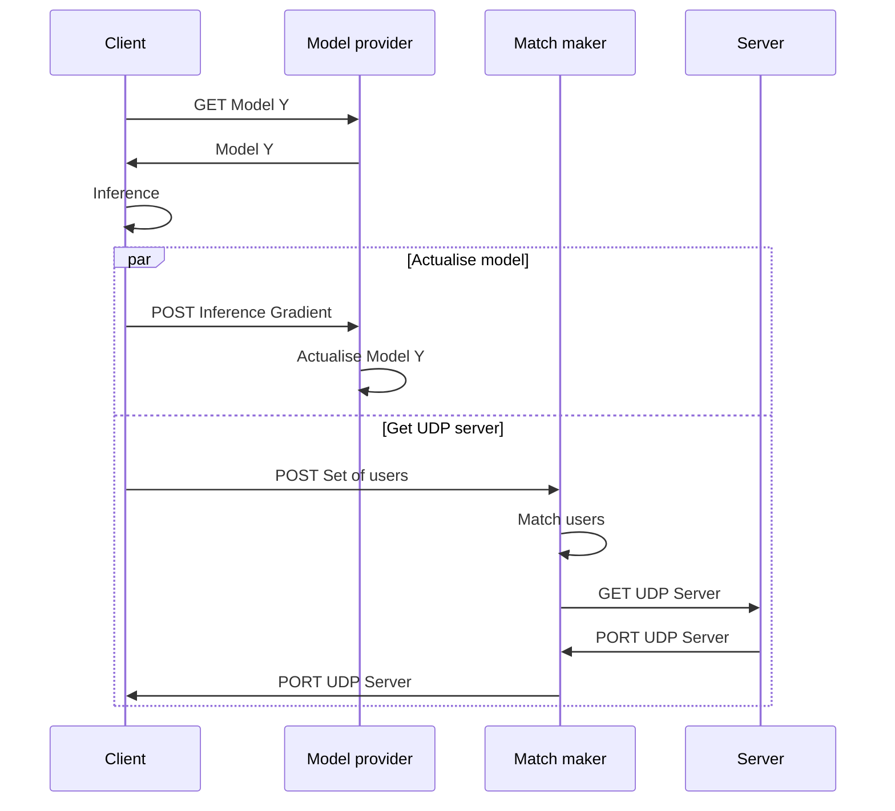
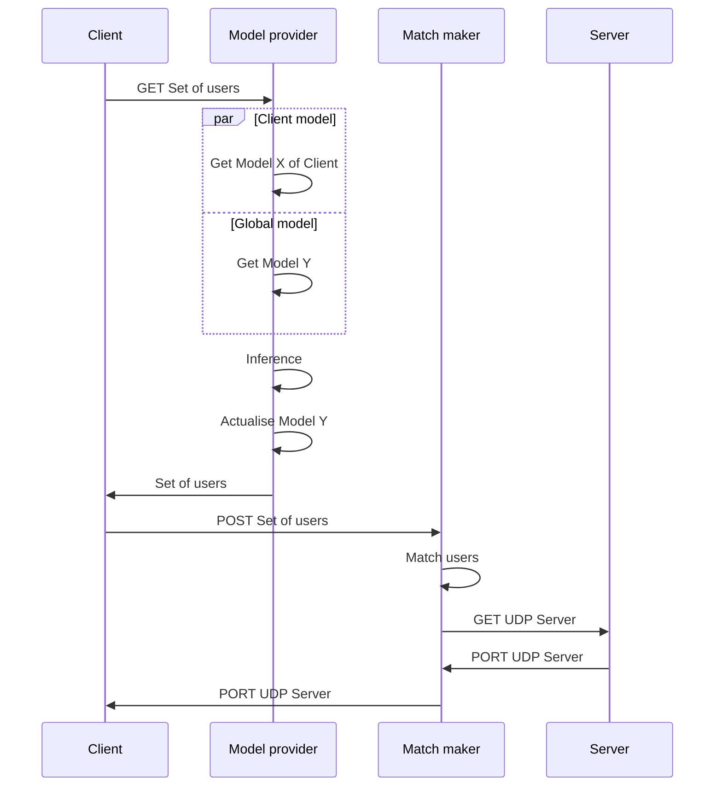
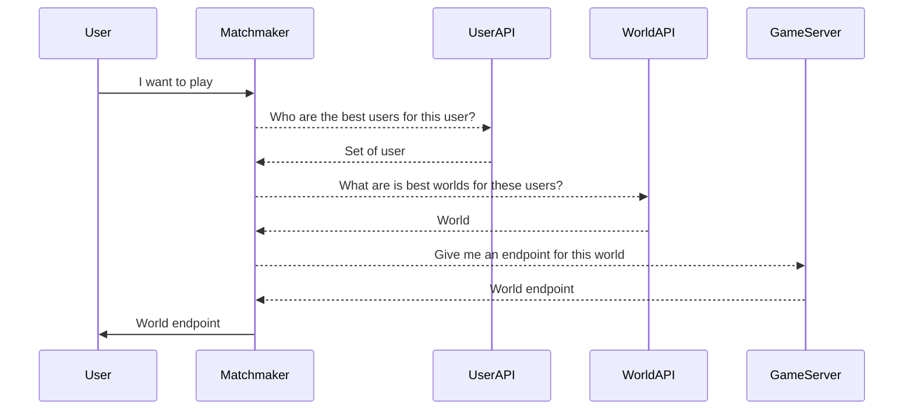
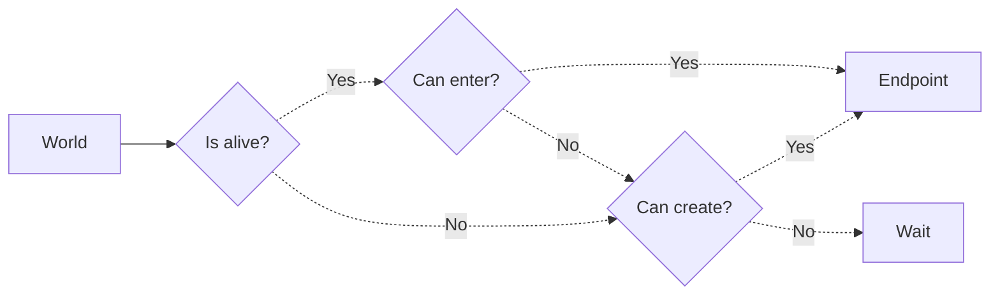

# super-duper-guacamole

# Codebase

```sh
# macOS: brew install cloc
>> cloc --exclude-ext=md --exclude-dir=.venv .  
     208 text files.
     123 unique files.                                          
     176 files ignored.

github.com/AlDanial/cloc v 1.92  T=0.10 s (1288.0 files/s, 84567.4 lines/s)
-------------------------------------------------------------------------------
Language                     files          blank        comment           code
-------------------------------------------------------------------------------
JSON                            29              0              0           3963
JavaScript                      42            199            188           1440
XML                             18              8              7            535
Gradle                           5             53            243            264
Objective-C                      4             42              6            191
HTML                             2              5             20            144
Bourne Shell                     3             24             39            132
Java                             3             16             25            126
YAML                             3              8              1            104
DOS Batch                        1             21              2             66
CSS                              2              6              0             45
Python                           1              4              1             20
Properties                       4             13             38             18
Starlark                         1              2              1             16
C/C++ Header                     2              6              0             11
GraphQL                          1              1              0             11
SVG                              1              0              0              1
ProGuard                         1              1              9              0
-------------------------------------------------------------------------------
SUM:                           123            409            580           7087
-------------------------------------------------------------------------------
```

# Architecture

## Sequence

### Distributed



In a **distributed architecture**, the code that infers the correct set of users belongs to the **client app**. Thus, it uses the client technologies: Godot and GDScript.

### Centralised



In a **centralised architecture**, the code that infers the correct set of users belongs to the **cloud**. Thus, it uses whatever languages.

> We will first choose the **centralised architecture** to use state-of-the-art libraries in Machine Learning with **Python**. However, we'll keep the code as close as possible to a **decentralised** version, so we will be able to switch later on. The objective is to verify as quickly as possible that the model works.

## Cloud

### Centralised


> `Federated` architecture will simply remove the **_client models_ database**
# super-duper-guacamole - *dev-godot*

# Architecture





> Will user who likes the same worlds will like eachothers? What dependence with the number of world?

### Codebase

```sh
# macOS: brew install cloc
>> cloc .
      21 text files.
      13 unique files.                              
      15 files ignored.

github.com/AlDanial/cloc v 1.92  T=0.02 s (824.1 files/s, 42345.6 lines/s)
-------------------------------------------------------------------------------
Language                     files          blank        comment           code
-------------------------------------------------------------------------------
Markdown                         2             67              0            173
Godot Scene                      1             23              0            129
GDScript                         2             29              5            114
JavaScript                       4             10              5             61
JSON                             1              0              0             28
Godot Resource                   2              5              0             17
Bourne Shell                     1              0              1              1
-------------------------------------------------------------------------------
SUM:                            13            134             11            523
-------------------------------------------------------------------------------
```

# Below isn't up to date

> Go to [https://awa-web-app.herokuapp.com](https://awa-web-app.herokuapp.com) for the Web version.

Development branch of **awa** application.

This branch aims to build a version based on a **decentralised** data storage technologie and puts **privacy** first.

# Useful links

- [Stack Overflow - Seeding the random number generator in javascript](https://stackoverflow.com/questions/521295/seeding-the-random-number-generator-in-javascript)

# Dependencies

- [React Native](https://reactnative.dev), code in *JavaScript* and build on *iOS* and *Android*.
- [Notifee](https://notifee.app), handles and displays notifications on *iOS* and *Android*.
- [React Native Firebase](https://rnfirebase.io), connects to a *Firebase* project, used to connect to *Firebase Cloud Messaging*.
- [GunDB](https://gun.eco), decentralised database.
- [Flyer Chat](https://flyer.chat), chat UI implementation
- [FastLane](https://fastlane.tools), tools to build and deploy iOS app and Android app automatically, used with *[GitHub Action](https://github.com/features/actions)*.

# Deployment

- [Heroku](https://heroku.com), hosts servers to redistribute notifications and relay-servers for *GunDB*.
- [Firebase](https://firebase.google.com), sends notifications to devices.
- [GitHub](https://github.com), stores codebase.
- [Google Play Console](https://play.google.com/console/), deploys the app to internal and external testers via mailing lists, and deploys app to *Google Play Store*.
- [App Store Connect](https://appstoreconnect.apple.com), deploys the app to internal and external testers via *TestFlight*, and deploys app to *AppStore*.

# Develop

```sh
git clone -b dev-gun --single-branch https://github.com/AdrKacz/super-duper-guacamole.git
cd super-duper-guacamole
```

## Files to add (if you build with your own project)

- `awa/ios/GoogleService-Info.plist`

# Run on *iOS* or on *Android*

```sh
cd awa
yarn
npx pod-install
```

*If you don't have `yarn` install, either use `npm` ([migrating from npm](https://classic.yarnpkg.com/lang/en/docs/migrating-from-npm/)) instead, or install [`yarn`](https://classic.yarnpkg.com/en/).*

`./awa` directory holds the codebase for the *React Native* project. Follow the official steps for [iOS deployment and Android deployment](https://reactnative.dev/docs/environment-setup) (switch to *React Native CLI QuickStart* tab).


# Steps for CI/CD (*do later, kind of bored on this*)

[Detox](https://wix.github.io/Detox/docs/introduction/getting-started)

```
brew tap wix/brew
brew install applesimutils

yarn add -D detox-cli
yarn add -D detox

yarn remove -D detox-cli
yarn remove -D detox
```

# How to build?

## Android

Go to `awa/android/app/build.gradle` and increase **Version code**.

```
cd awa/android
./gradlew bundleRelease
```

If there are errors, open **Android Studio** and build from here to see what are the problems. Most of the time file are duplicated, which causes problem when instantiate classes.

Then go to Google Play Console, update a new build.

## Web

```
heroku login
git subtree push --prefix awa-web heroku master
```

## iOS

Increment build number at `awa/ios/awa.xcodeproj`

Go to `Action` and run `Fastlane iOS CD`
