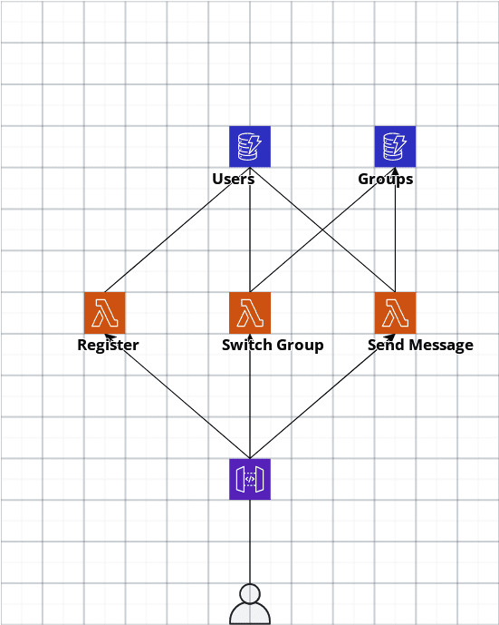
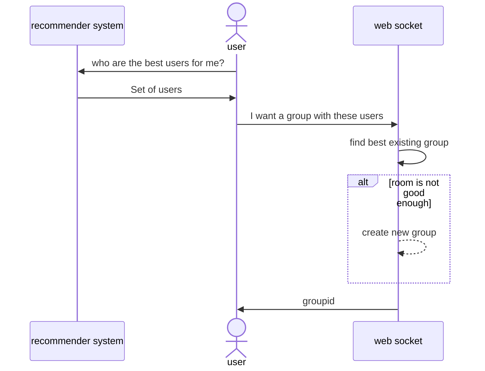
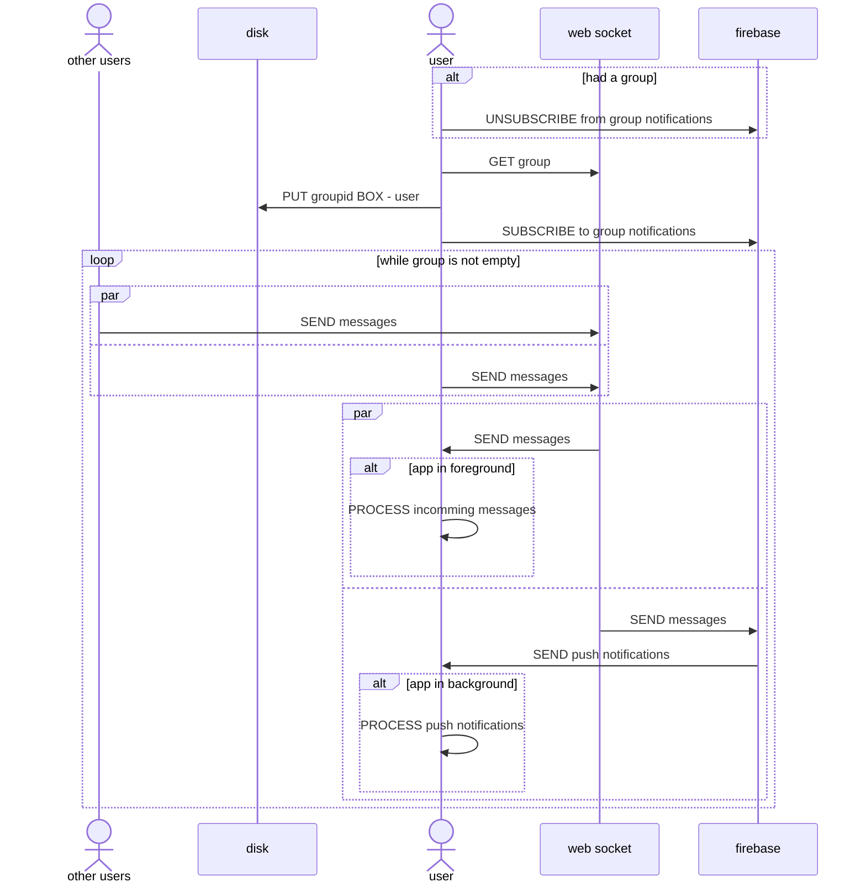
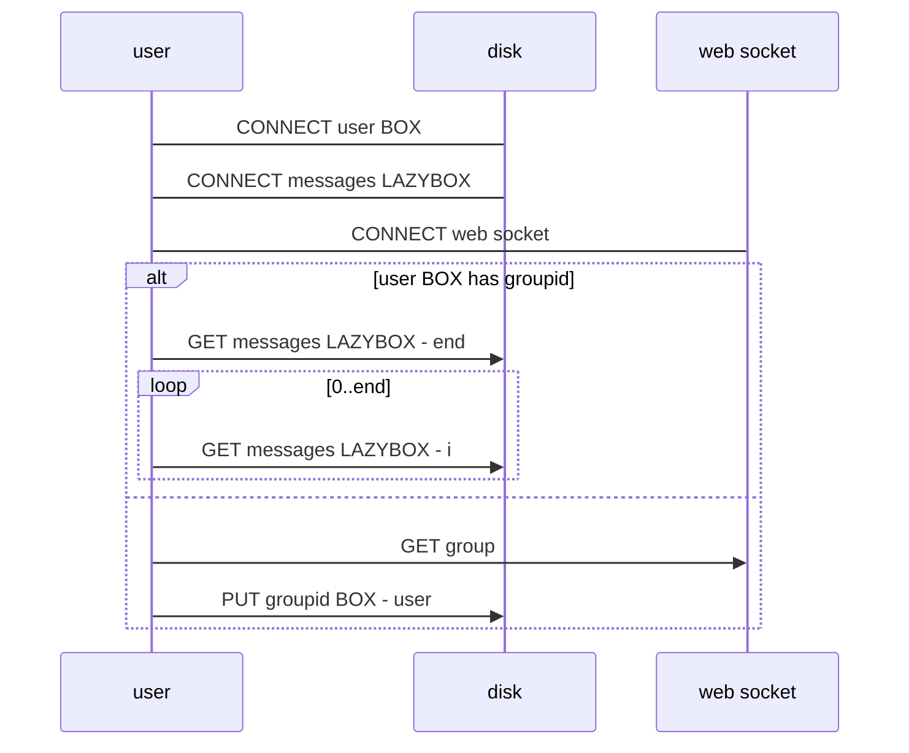
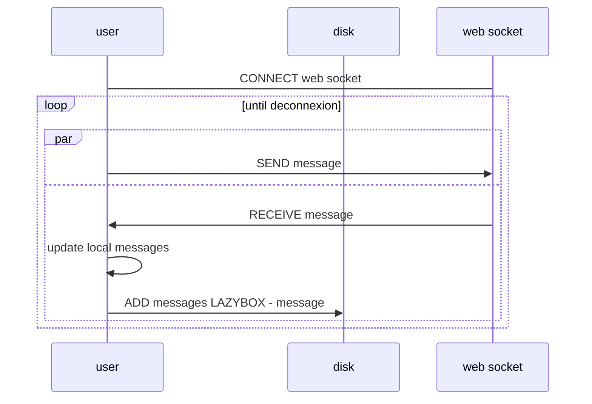

# super-duper-guacamole

> [Awa - Notion](https://purring-shark-0e9.notion.site/Awa-048af14525474c29828c867d0ba553a6)

> [Awa - University Slides](https://docs.google.com/presentation/d/1QThoIvIGAeG6SlSOOstbqLRikrF3WBQCePyzSukguPY/edit?usp=sharing) *(written in French for our university)*

> Awa Drive on Google Drive (ask for permission)

> [Awa - Post Man](https://awa-ma.postman.co)

> [Awa - Cloudcraft](https://app.cloudcraft.co)

# Cloud Architecture

> We chose a **centralised architecture** to use state-of-the-art libraries in Machine Learning with **Python**. However, we keep the code as close as possible to a **decentralised** version, so we will be able to switch later on. The goal is to verify the model works.

## Current Architecture - Centralised - Serverless

<p float="left" align="middle">
    
</p>

> This architecture is *centralised*

# Sequence Diagram
In a **centralised architecture**, the code that infers the correct set of users belongs to the **cloud**. Thus, it uses whatever languages.

## Ideal Architecture - Distributed and Decentralised

> `Federated` architecture will simply remove the **_client models_ database**

In a **distributed architecture**, the code that infers the correct set of users belongs to the **user app**. Thus, it uses the client technologies.

# How an user find a group?



# Groups lifecycle

## What happens when you change group?



# Disk management

## On open



## On send message



# Screenshots

<p float="left" align="middle">
    
    
    
    
    
    
    
    
    
</p>
---

### Note on Godot

Using **Godot** for a simple chat may *not be the best idea*. Indeed, **Godot** is really useful when it comes to *real-time 2D* and *real-time 3D*. Using a standard technology (*ReactNative*) would be more appropriate here.

### Note on Flutter

**Flutter** is quicker to setup than **React Native** *(I mean, literally quicker, it doesn't burn my laptop)*. I've used (Flutter Chat UI)[https://pub.dev/packages/flutter_chat_ui] to get a first chat without coding. *The same framework was available with **React Native***

<details><summary>Codebase</summary>
<p>

```sh
# macOS: brew install cloc
>> cloc --exclude-ext=md .
    6070 text files.
    3094 unique files.                                          
    8876 files ignored.

github.com/AlDanial/cloc v 1.92  T=14.74 s (209.9 files/s, 98342.9 lines/s)
-----------------------------------------------------------------------------------
Language                         files          blank        comment           code
-----------------------------------------------------------------------------------
Assembly                             1              0              0         759768
Python                            1314          56070          65594         245916
C                                   11          13263          65387         116009
JSON                               807              5              0          50858
Objective-C                        137           3438           3601          17625
XML                                445           1190            703          15063
Cython                              47           2267           1020           8091
C/C++ Header                       235           2798           9312           5440
Markdown                             1            321              0           1517
Dart                                 5            104             77            687
C++                                  5             81             29            317
HTML                                 2             12             28            265
Properties                          17              0             13            251
Bourne Shell                         5             30             33            227
CMake                                4             34             30            167
Godot Scene                          1             23              0            133
GDScript                             2             37              5            129
Bourne Again Shell                   1             19             20            121
JavaScript                           5             16             10            106
PowerShell                           1             48             89            104
Gradle                               3             21              1            103
Java                                11             13             43            103
Fish Shell                           2             26             26             76
Windows Resource File                1             23             29             69
reStructuredText                     3             15              0             69
DOS Batch                            1             24              2             64
YAML                                 4             22             84             58
Dockerfile                           4             18             11             37
C Shell                              2             18             10             22
Godot Resource                       2              5              0             17
Swift                                1              1              0             12
D                                   11              0              0             11
Ruby                                 1              1              6             11
Kotlin                               1              2              0              4
SQL                                  1              0              0              2
-----------------------------------------------------------------------------------
SUM:                              3094          79945         146163        1223452
```

</p>
</details>

