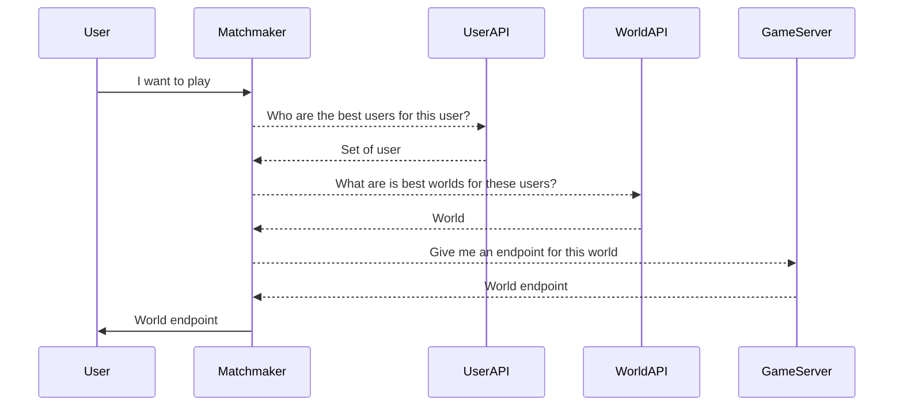
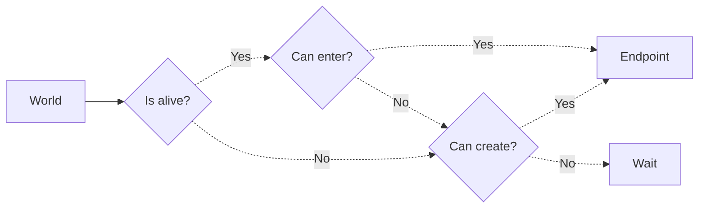

# super-duper-guacamole - *dev-godot*

### Codebase

```sh
# macOS: brew install cloc
>> cloc --exclude-ext=md .
      23 text files.
      12 unique files.                              
      19 files ignored.

github.com/AlDanial/cloc v 1.92  T=0.02 s (516.5 files/s, 19627.1 lines/s)
-------------------------------------------------------------------------------
Language                     files          blank        comment           code
-------------------------------------------------------------------------------
Godot Scene                      1             23              0            129
GDScript                         2             29              5            114
JavaScript                       4             10              5             61
JSON                             1              0              0             28
Dockerfile                       1              6              5             17
Godot Resource                   2              5              0             17
Bourne Shell                     1              0              1              1
-------------------------------------------------------------------------------
SUM:                            12             73             16            367
-------------------------------------------------------------------------------
```

# Architecture





> Will user who likes the same worlds will like eachothers? What dependence with the number of world?

# How to run your server?

**The following only concerns world that works over UDP. Do not use the following instruction if your world uses WebRTC.**

## Export your Godot server

1. Open your project in **Godot**
2. Go to *Project* > *Export...*
3. If there is no export pre-defined for **Server Linux/X11** *(or whatever export name you want, just keep it consistent)*
    1. Click *Add...* > *Linux/X11*
    2. Click the **Folder icon** next to *Export path*
    3. Click the **Up arrow** in the upper right to *go to parent folder*
    4. Select *exports* > *linux*
    5. Enter **server** in *File input* *(or whatever filename you whant, but you'll have to editing the Dockerfile accordingly)*
    6. Enter **Server Linux/X11** in *Name input*
4. Select **Server Linux/X11** if not already selected
5. Click *Export PCK/Zip*
6. Enter **server** in *File input* if it is not pre-entered *(or whatever filename you whant, but you'll have to editing the Dockerfile accordingly)*
7. Select *Godot Game Pack (\*.pck)* as extension
8. Uncheck *Export With Debug*
9. Click *Save*

Well done! You now have your server exported under *exports/linux/server.pck*.

## Create your Docker image

1. Open your terminal and verify that Docker is installed (type `docker --version`), if not, follow instruction at [Get Docker](https://docs.docker.com/get-docker/)
2. In your terminal, go to your working directory *super-duper-guacamole*
3. If you changed the name of your exported file
    1. Open *Dockerfile*
    2. On line `27`, edit the path accordingly
4. Run `docker build -t awa-server .`

Well done! You now have your docker image built. Run `docker images` to see it.

## Test your Docker image

1. Open your terminal with Docker installed, and go to your working directory *super-duper-guacamole*
2. Verify that your image exists with `docker images`
3. Run you image with `docker run -dp 8080:8080/udp awa-server`
4. Verify that your container is running with `docker ps`
5. Open a new terminal and go to your working directory *super-duper-guacamole/awa-chat*
6. Run `godot`
7. Your client is now open, verify that everything behave correctly

Well done! You now have an image that can run a container correctly.

> **Tips:** you can look at the *logs* of your container with `docker logs <CONTAINER ID>`, you'll find your *CONTAINER ID* with `docker ps`

> **Tips:** you can stop and remove your container with `docker rm -f <CONTAINER ID>`

## Export your Docker image to DockerHub

1. Sign up or sign in to [DockerHub](https://hub.docker.com/)
2. Click the *Create Repository* button
3. Name it *awa-server*, and add the description you want
4. Click the *Create* button
5. Open your terminal with Docker installed, and go to your working directory *super-duper-guacamole*
6. Tag your image with the correct name with `docker tag awa-server <YOUR USERNAME>/awa-server` *(find the correct username under the Docker commands section on your DockerHub image page)
7. Login to you DockerHub account with `docker login -u <YOUR USERNAME>`
8. Push your image to DockerHub with `docker push <YOUR USERNAME>/awa-server`

Well done! You now have your image ready to deploy to the web easily

## Run you image on an AWS Lightsail instance from DockerHub

1. Sign up or sign in to [AWS Console](https://signin.aws.amazon.com/signin)
2. Type *Lightsail* in the search bar and click the *Lightsail* button
3. If you have no instance running
    1. Click the *Create instance* button
    2. Select *Linux/Unix* and *OS Only* > *Amazon Linux 2*
    3. Add *Launch script* below to install Docker on your instance
    4. *[Optional]* Change your SSH key pair
    5. Choose your instance plan
    6. Give a name to your instance
    7. Click the *Create instance* button
4. Select your instance, and go to the *Networking* tab
5. Under *IPv4 Firewall* click the *+ Add Rule* button
6. Select *Application* > *Custom*, *Protocol* > *UDP*, and set the correct port range *(8080 in the original code)*
7. *[Optional]* Restrict to the IP addresses that will use your server if you know them *(best security practice)*
8. Go to the *Connect* tab, and click the *Connect using SSH* button
9. Verify that Docker is correctly installed with `docker --version`
11. Run your image with `docker run -dp 8080:8080/udp <YOUR USERNAME>/awa-server`
    1. If the port `8080` is already used on your machine, you can use any other port, just replace the command with `docker run -dp <YOUR PORT>:8080/udp <YOUR USERNAME>/awa-server`, and don't forget to open it in the `Networking` tab

Well done! You now have a running container of your server in the Web.

> **Tips**: Plans $3.5, $5, and $10 offer 3 months free.

### Launch script

```sh
sudo yum update -y
sudo amazon-linux-extras install docker
sudo yum install docker
sudo service docker start
sudo systemctl enable docker
sudo usermod -a -G docker ec2-user
```

## Test your online container

1. Go to your AWS Account > Lightsail, and select your instance
2. Go to the *Networking* tab
3. If your instance doesn't have a *Public IP*, attach one
4. Copy your *Public IP*
5. Open your terminal, and go to your working directory *super-duper-guacamole/awa-chat*
6. Run `godot`, and connect to your online container
7. Verify that everything works as expected

Well done! You now have a working server that you can connect to anywhere in the world.

# How to export your Godot project for iOS?

Follow the instruction at [Export for iOS](https://docs.godotengine.org/en/stable/tutorials/export/exporting_for_ios.html)

>To explained: *How to get your App Store Team ID and Bundler?* *How to get the required icons?*

# How to export your Godot project for Android?

Follow the instruction at [Export for Android](https://docs.godotengine.org/en/stable/tutorials/export/exporting_for_android.html)

---

# Below isn't up to date

> Go to [https://awa-web-app.herokuapp.com](https://awa-web-app.herokuapp.com) for the Web version.

Development branch of **awa** application.

This branch aims to build a version based on a **decentralised** data storage technologie and puts **privacy** first.

# Useful links

- [Stack Overflow - Seeding the random number generator in javascript](https://stackoverflow.com/questions/521295/seeding-the-random-number-generator-in-javascript)

# Dependencies

- [React Native](https://reactnative.dev), code in *JavaScript* and build on *iOS* and *Android*.
- [Notifee](https://notifee.app), handles and displays notifications on *iOS* and *Android*.
- [React Native Firebase](https://rnfirebase.io), connects to a *Firebase* project, used to connect to *Firebase Cloud Messaging*.
- [GunDB](https://gun.eco), decentralised database.
- [Flyer Chat](https://flyer.chat), chat UI implementation
- [FastLane](https://fastlane.tools), tools to build and deploy iOS app and Android app automatically, used with *[GitHub Action](https://github.com/features/actions)*.

# Deployment

- [Heroku](https://heroku.com), hosts servers to redistribute notifications and relay-servers for *GunDB*.
- [Firebase](https://firebase.google.com), sends notifications to devices.
- [GitHub](https://github.com), stores codebase.
- [Google Play Console](https://play.google.com/console/), deploys the app to internal and external testers via mailing lists, and deploys app to *Google Play Store*.
- [App Store Connect](https://appstoreconnect.apple.com), deploys the app to internal and external testers via *TestFlight*, and deploys app to *AppStore*.

# Develop

```sh
git clone -b dev-gun --single-branch https://github.com/AdrKacz/super-duper-guacamole.git
cd super-duper-guacamole
```

## Files to add (if you build with your own project)

- `awa/ios/GoogleService-Info.plist`

# Run on *iOS* or on *Android*

```sh
cd awa
yarn
npx pod-install
```

*If you don't have `yarn` install, either use `npm` ([migrating from npm](https://classic.yarnpkg.com/lang/en/docs/migrating-from-npm/)) instead, or install [`yarn`](https://classic.yarnpkg.com/en/).*

`./awa` directory holds the codebase for the *React Native* project. Follow the official steps for [iOS deployment and Android deployment](https://reactnative.dev/docs/environment-setup) (switch to *React Native CLI QuickStart* tab).


# Steps for CI/CD (*do later, kind of bored on this*)

[Detox](https://wix.github.io/Detox/docs/introduction/getting-started)

```
brew tap wix/brew
brew install applesimutils

yarn add -D detox-cli
yarn add -D detox

yarn remove -D detox-cli
yarn remove -D detox
```

# How to build?

## Android

Go to `awa/android/app/build.gradle` and increase **Version code**.

```
cd awa/android
./gradlew bundleRelease
```

If there are errors, open **Android Studio** and build from here to see what are the problems. Most of the time file are duplicated, which causes problem when instantiate classes.

Then go to Google Play Console, update a new build.

## Web

```
heroku login
git subtree push --prefix awa-web heroku master
```

## iOS

Increment build number at `awa/ios/awa.xcodeproj`

Go to `Action` and run `Fastlane iOS CD`
