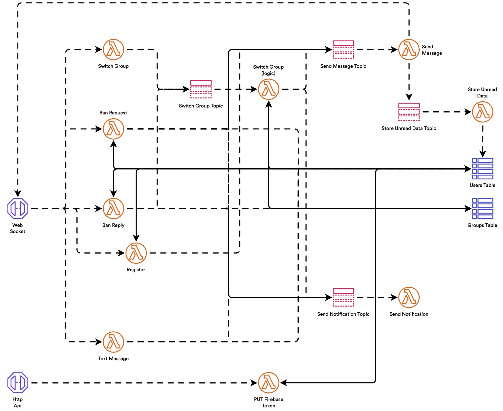

> AWA © 2022 by Adrien Kaczmarek is licensed under AWA SHARE SOURCE LICENSE

# super-duper-guacamole

- [Google Drive](https://drive.google.com/drive/folders/1VGYTlRhyS1SivX0uCPNUiKHsgLy7AHK3?usp=sharing)
- [Notion](https://purring-shark-0e9.notion.site/Awa-048af14525474c29828c867d0ba553a6)
- [Post Man](https://awa-ma.postman.co)
- [Terrastruct](https://app.terrastruct.com/console)

# Cloud Architecture

<p float="left" align="middle">
    
</p>

# Application

<p float="left" align="middle">
    
</p>

# Brief overview of the [LICENSE](./LICENSE)

AWA wants everyone to be able to look into its source code and to learn with it.

However, AWA doesn't want you to steal its source code and use it for your own business.

AWA SHARE SOURCE LICENSE lets you explore the code, AWA hope you will enjoy!

**Feel free to open an _ISSUE_ for anything you thing should be improved or fixed.**

# Codebase

<details><summary>CLOC command</summary>
<p>

```sh
# macOS: brew install cloc
$ cloc --config=options.txt .
```
</p>
</details>

Language|files|blank %|comment %|code
:-------|-------:|-------:|-------:|-------:
Dart|21|10.90|5.90|2018
JavaScript|13|19.36|25.89|1348
YAML|8|8.27|9.78|992
Markdown|11|34.44|0.00|842
Python|10|22.59|43.09|810
**SUM:**|**63**|**17.24**|**15.21**|**6010**

