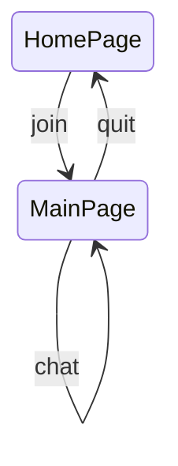
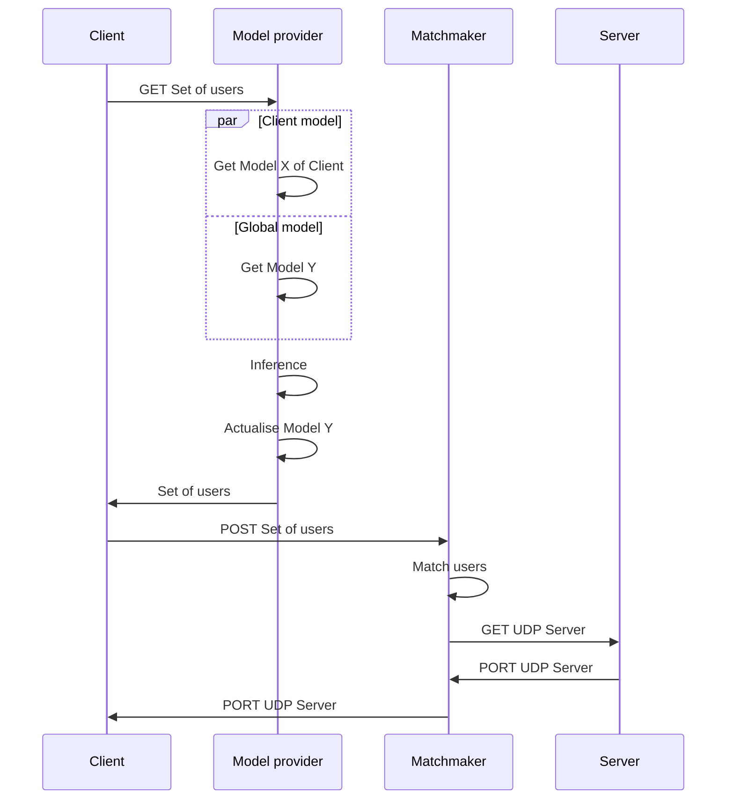
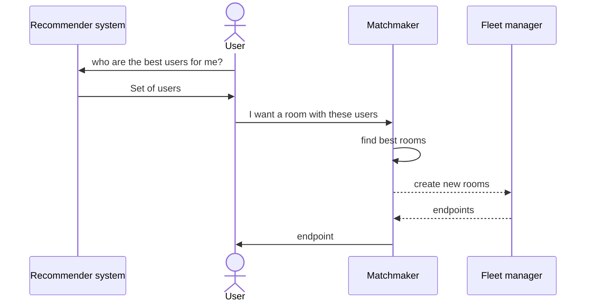
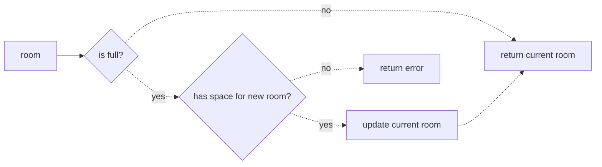
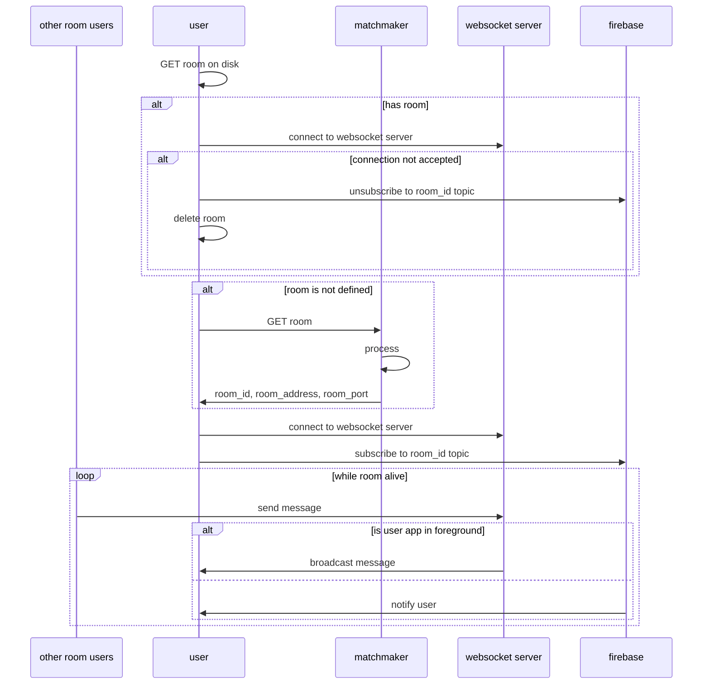
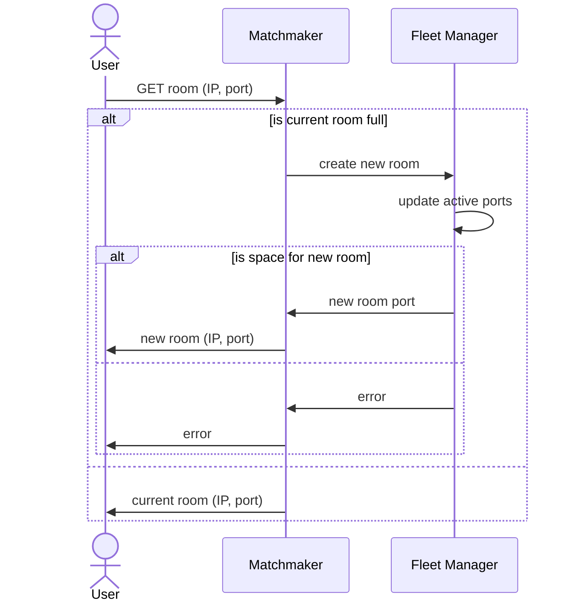
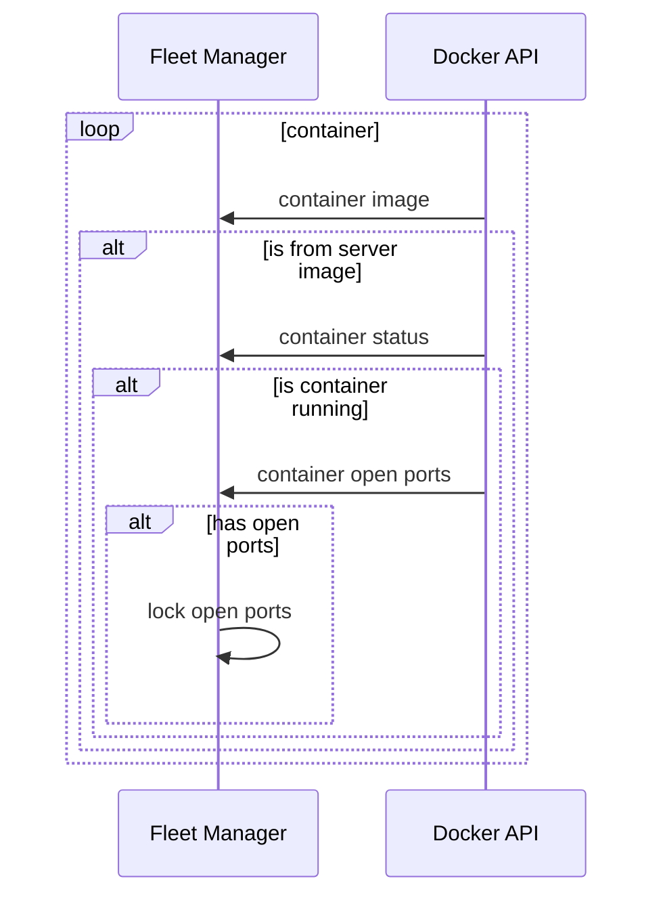

# super-duper-guacamole

# Cloud Architecture

## Current Architecture


> This architecture is *centralised*

## Ideal Architecture

> `Federated` architecture will simply remove the **_client models_ database**

# App states



# Sequence Diagram

## Distributed


In a **distributed architecture**, the code that infers the correct set of users belongs to the **client app**. Thus, it uses the client technologies: Godot and GDScript.

## Centralised



In a **centralised architecture**, the code that infers the correct set of users belongs to the **cloud**. Thus, it uses whatever languages.

> We will first choose the **centralised architecture** to use state-of-the-art libraries in Machine Learning with **Python**. However, we'll keep the code as close as possible to a **decentralised** version, so we will be able to switch later on. The objective is to verify as quickly as possible that the model works.

# How an user find a room?





## Questions

> Will user who likes the same worlds will like eachothers? Will it work with few worlds?

# How room are managed?

## User start Awa



## User ask for a room



## Fleet manager update active ports



# Screenshots

<p float="left" align="middle">
    
    
    
    
    
    
    
</p>

---

### Note on Godot

Using **Godot** for a simple chat may *not be the best idea*. Indeed, **Godot** is really useful when it comes to *real-time 2D* and *real-time 3D*. Using a standard technology (*ReactNative*) would be more appropriate here.

### Note on Flutter

**Flutter** is quicker to setup than **React Native** *(I mean, literally quicker, it doesn't burn my laptop)*. I've used (Flutter Chat UI)[https://pub.dev/packages/flutter_chat_ui] to get a first chat without coding. *The same framework was available with **React Native***

# Codebase

```sh
# macOS: brew install cloc
>> cloc --exclude-ext=md .  
     266 text files.
     120 unique files.                                          
     400 files ignored.

github.com/AlDanial/cloc v 1.92  T=0.15 s (781.9 files/s, 57922.8 lines/s)
-----------------------------------------------------------------------------------
Language                         files          blank        comment           code
-----------------------------------------------------------------------------------
XML                                 39              7             45           3089
C/C++ Header                        26            348           1937            773
JSON                                11              1              0            603
C++                                  5             81             29            317
CMake                                4             34             30            167
Bourne Shell                         3             24             26            155
Dart                                 4             34             23            152
Bourne Again Shell                   1             19             20            121
YAML                                 4             26             82            109
Gradle                               3             19              3             88
HTML                                 1              9             15             80
Windows Resource File                1             23             29             69
DOS Batch                            1             24              2             64
JavaScript                           4             10              5             61
Markdown                             1              6              0             26
Objective-C                          3              6              4             21
Java                                 1              3              5             16
Swift                                1              1              0             12
Ruby                                 1              1              6             11
Properties                           3              0              1             10
Kotlin                               1              2              0              4
D                                    2              0              0              2
-----------------------------------------------------------------------------------
SUM:                               120            678           2262           5950
-----------------------------------------------------------------------------------
```