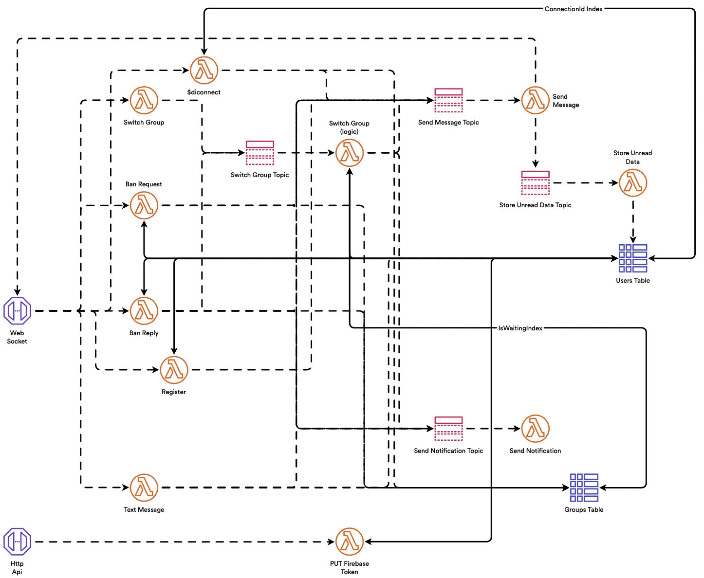

# super-duper-guacamole

- [Google Drive](https://drive.google.com/drive/folders/1VGYTlRhyS1SivX0uCPNUiKHsgLy7AHK3?usp=sharing)
- [Notion](https://purring-shark-0e9.notion.site/Awa-048af14525474c29828c867d0ba553a6)
- [Post Man](https://awa-ma.postman.co)
- [Terrastruct](https://app.terrastruct.com/console)
- [(*Legacy*) Cloudcraft](https://app.cloudcraft.co)

# Cloud Architecture

We write *client-side* code on our server to use state-of-the-art **Python** libraries in *Machine Learning*.

We decoupled our code to move it from our server to our client.

## Current Architecture - Centralised - Serverless

<p float="left" align="middle">
    
</p>

# Demo

<p float="left" align="middle">
    
</p>

# Codebase

<details><summary>CLOC command</summary>
<p>

```sh
# macOS: brew install cloc
$ cloc --config=options.txt .
```
</p>
</details>

Language|files|blank %|comment %|code
:-------|-------:|-------:|-------:|-------:
Dart|21|10.90|5.90|2018
JavaScript|13|19.36|25.89|1348
YAML|8|8.27|9.78|992
Markdown|11|34.44|0.00|842
Python|10|22.59|43.09|810
**SUM:**|**63**|**17.24**|**15.21**|**6010**

