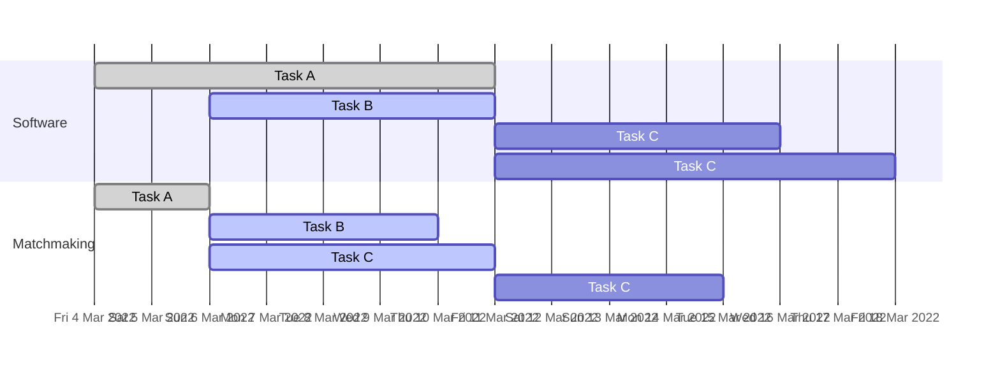

```mermaid
gantt
    dateFormat YYYY-MM-DD
    axisFormat %a %e %b %Y

    section Software
        Task A : done, s1, 2022-03-04, 7d 
        Task B : active, s2, after s1, 5d
        Task C : s31, after s2, 5d 
        Task C : s32, after s2, 7d 

    section Matchmaking
        Task A : done, s1, 2022-03-04, 2d 
        Task B : active, s21, after s1, 4d
        Task C : active, s22, after s1, 5d 
        Task C : s3, after s21 s22, 4d
```