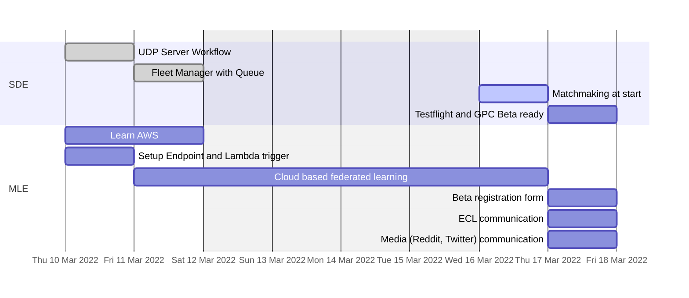

# Roadmap

> Une tâche est considéré comme terminée une fois qu'elle est *merged* dans la *main branch* avec sa documentation.

> La soutenance aura lieu de 24 mars, la *roadmap* se termine le 18 mars. Cela nous laisse le 23 mars pour une gérer d'éventuels *bug* et corriger la documentation.