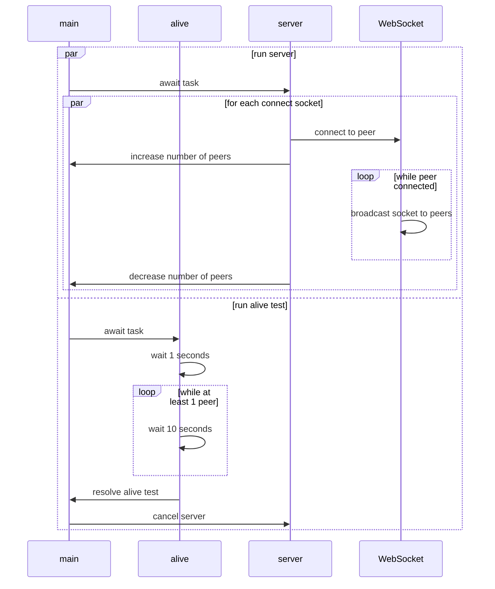

# WebSocket Server



### Development

```sh
# zsh
cd server
python3 -m venv venv
source venv/bin/activate
pip install --upgrade pip
pip install websockets
```

```sh
# list open ports
lsof -i -P -n | grep LISTEN
```

```sh
# Open a server
docker run -dp xxxx:8765 adrkacz/awa-server:python
# Close server
docker rm -f <docker-container-id>
```

To manage container, we will use [Docker SDK - Python](https://docs.docker.com/engine/api/sdk/examples/).

```sh
pip install docker
```

```py
# List active container and stop one
import docker
client = docker.from_env()
for container in client.containers.list():
  print(container.id)
  if container.id == id_to_stop:
      container.stop()
      break
```

```py
# Run a container
import docker
client = docker.from_env()
container = client.containers.run("adrkacz/awa-server:python", detach=True)
print(container.id)
```