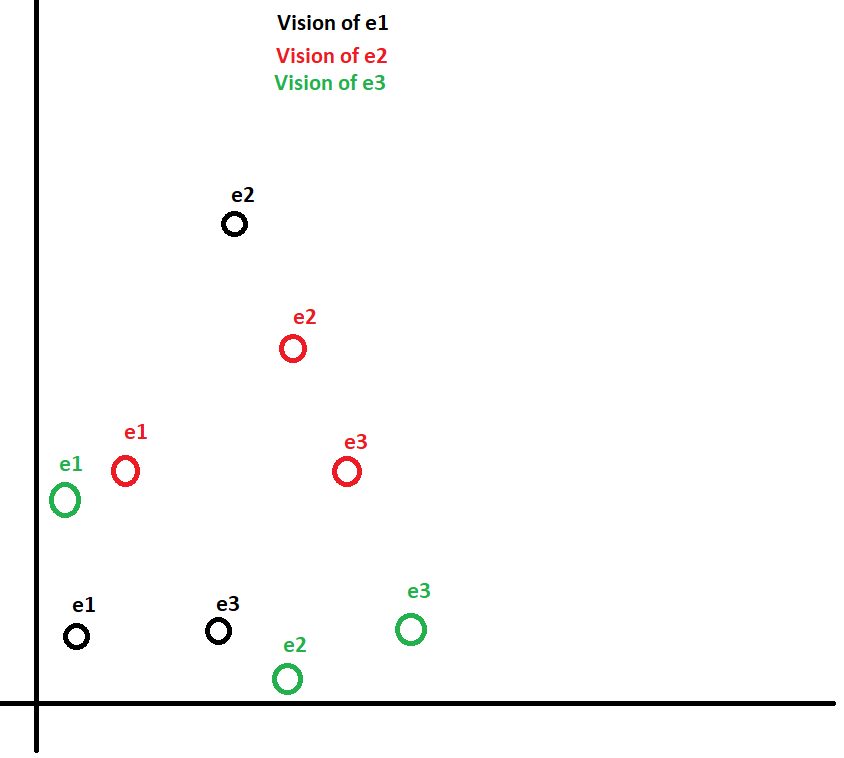
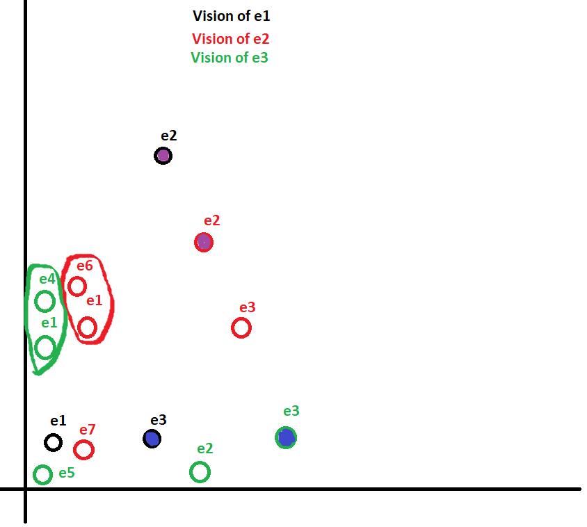

**Version 0**

# Model to assign people to conversation groups

## Introduction
One of the main idea of the project is to develop a software solution to assign people **apparently randomly** to conversation groups. However, we aim to create groups which have a positive dynamic, hence, an automatic learning answering to 'how to assign people' is required. In a distributed architecture, we haven't access to people information globally, so we have to do everything 'locally'.

# Local information available
Each individual has access to :

- Its own ID
- The ID of the people he has talked with
- The message that were exchange in the different conversations he was involved in.

If a conversation is composed of m members : All of those members know each others (access to the m ID) and the messages exchanged.

# Create a new conversation
Lets first introduce the notion of **Relationship representation**.

## Relationship private representation
With the local information available (detailled later), we compute scores/weights, of n dim, **in the vision of each ID/individual**. This reprensentation is **PRIVATE**.

e.g : See below, reprensentation in 2D (let's say it is a PCAof the generated weights)
In the vision of e1, he is closer to e3  than to e2 , but in the vision of e3, e2 is closer than e1. This vision is -or at least can be- **INDIVIDUALS DEPENDENT** (depends of how weights are generated, potential absence of symmetry). 

## From Relationship Reprensentation (RR) to recommendations
Hence, to create a new conversation : For conversations of max m individuals, if :
- e1 knows ei for i∈[1,m]
- e2 is the closest individual to e1
- e2 knows ej for j∈[m+1,2m] because he is involved in an other conversation.\
--> **e2 recommand APPROPRIATE individuals to e1 (close to him in the e2 RR**, whom would be unkown for e1 : He meets new people, with a kind of 'recommendation system'.
Needs to be clear : e2 only provides a ej ID, j∈[m+1,2m], and not his distance to  e1 in the  e2 representation. **The RR is private, and is never transmitted in whole**.

To recap :
- Each individual in the e1 RR will recommend him somebody.
- Sometimes it can be the same individual.
- We will introduce weights that depends of e1 proximity to the 'recommender' ei, i∈[1,m]. (The closest the 'recommender' is, the more we should listen to him, he is a 'close friend').

Below : A graphic illustration of this 'loophole' point of view. \
- Recommendation by e2 : e6
- Recommendation by e3 : e4
- e4 will have a larger weight than e6 because e3 is closer from e1 than e2

# Main points still to determine :
## Weight the recommendations
2 options are possible :
- Distance (continuous) weighting : Compute d(e1, ei), where d is an distance to define. Then the weithing term is
- Discrete weighting : Giving the rank of the ei in the 'Proximity ranking', we attribute fixed weights. Could be appropriate if we don't have a distance to compute. (Example: In the beginning we could compute logic gates on the weights computed.)

## n-representation Features for clustering system

- Frequency of answer to somebody
- Content of the messages --> Sentiment analysis : Pay attention to the ironie/insults that can skew the results
- Topics identified

### Test : Use GPT-2 to see if it is working correctly.

## Uses of a Meta-Model
- Which clustering models would be the most relevant ? 
- Do we need to select it in function of the individuals ?
- Would it be a good idea to switch models randomly in order to create noise in the clustering and vary the recommended people.