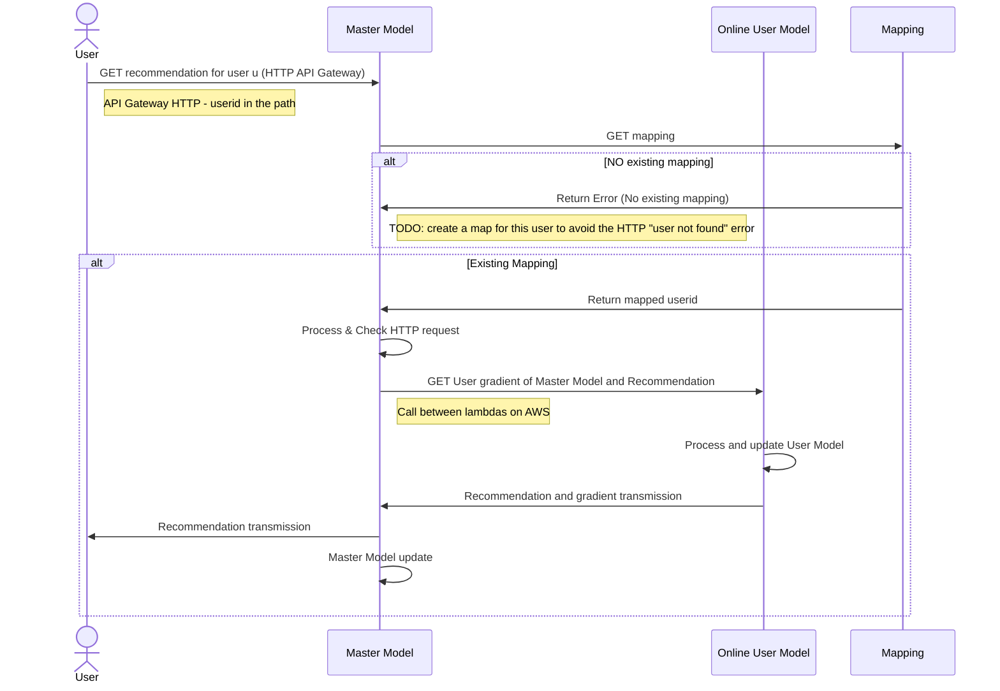
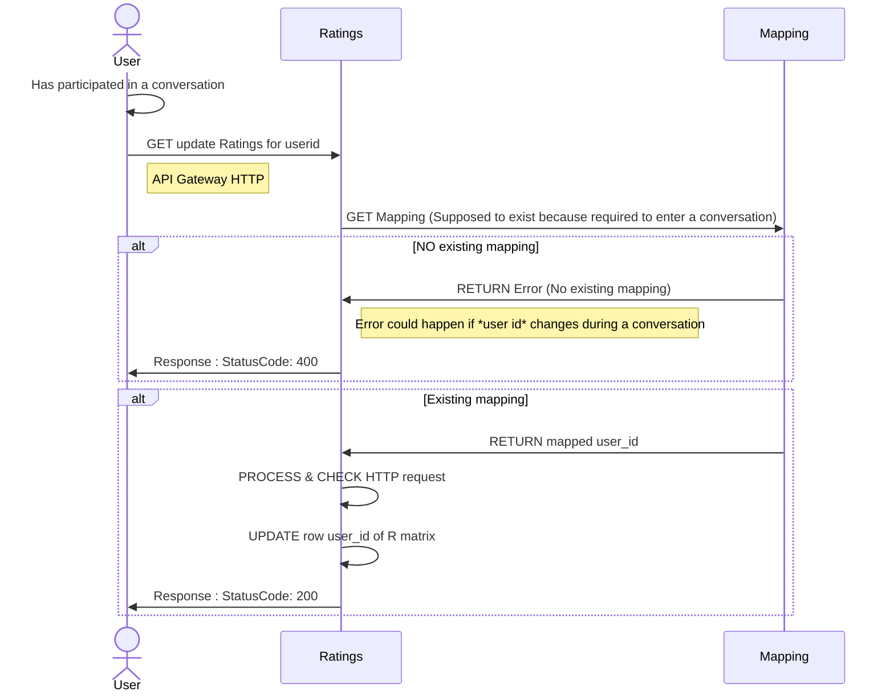
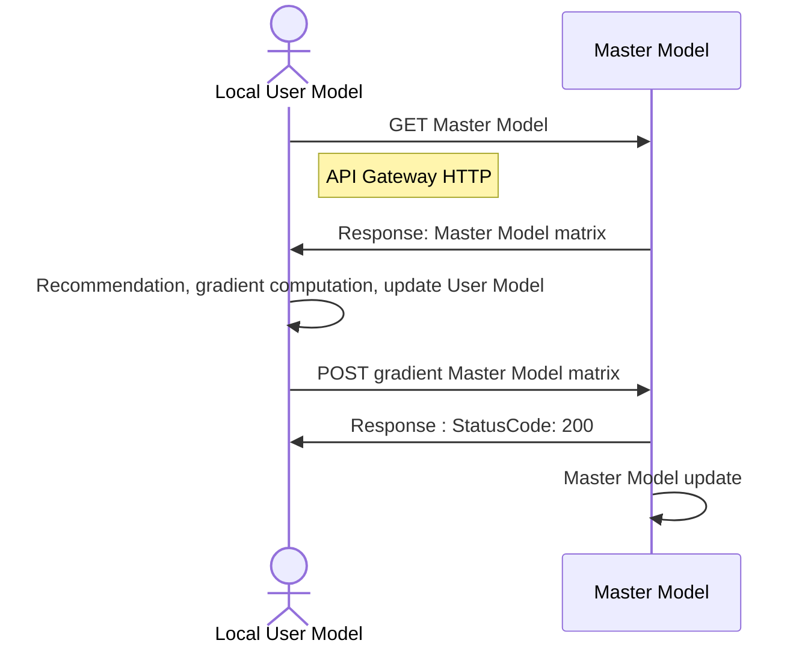

# Recommender system

## Introduction
We want to:
- assign people to conversation groups (the challenge is to match them with people they will like while not matching them always with the same people),
- preserve the privacy of the users.

We implement a federated algorithm[^model0] to reach our goals. The algorithm works with data without aggregating them on a server.

# Local information available
Locally each user has access to, at a given time:
- its ID,
- IDs of the users of its current conversations,
- messages of its current conversations.

# Structure of the Machine Learning Algorithm:
# Actual-Online sequence diagrams
## To get a recommendation list


## To update the rating matrix

# Future-Local sequence diagrams
## Desired-Local and Privacy preserving sequence diagram



# AWS Setup:
We use Python with NumPy in an AWS Lambda function. NumPy is not available in the Python AWS default environment. The only solution proposed in the AWS documentation that we succeeded to implement was to create a dockerized environment.

## Container setup with Docker for Python[^cont0][^cont1]
1. Create a project directory for your new function on your computer (here *recommender-system*).
2. Open your project directory and add a file named `app.py`.
3. Add your code to `app.py` (you need a handler function).
```
# app.py - hello world example
import numpy

def handler(event, context):
    return np.zeros((10,10))
```
4. In your project directory, add a file named `requirements.txt`. List each required library as a separate line in this file.
5. Create a Dockerfile:  
(Install dependencies under the `${LAMBDA_TASK_ROOT}` directory alongside the function handler to ensure that the Lambda runtime can locate them when you invoke your function.)
```
FROM public.ecr.aws/lambda/python:3.9

# Copy function code
COPY app.py ${LAMBDA_TASK_ROOT}

# Install the function's dependencies using file requirements.txt
# from your project folder.

COPY requirements.txt  .
RUN  pip3 install -r requirements.txt --target "${LAMBDA_TASK_ROOT}"

# Set the CMD to your handler (could also be done as a parameter override outside of the Dockerfile)
CMD [ "app.handler" ]
```

5. Create an Amazon ECR repository using the AWS Console (*it is easier*). Copy the corresponding URI.

6. Authenticate the Docker CLI to your Amazon ECR registry.  
```
aws ecr get-login-password --region eu-west-3 | docker login --username AWS --password-stdin 123456789012.dkr.ecr.eu-west-3.amazonaws.com
```

7. Build your Docker image with:
```
docker build -t 123456789012.dkr.ecr.us-east-1.amazonaws.com/hello-world:latest
```
8. Push it in the ECR with 
```
docker push 123456789012.dkr.ecr.us-east-1.amazonaws.com/hello-world:latest
```

> **You need to enter the folder where you put your Dockerfile to build**

## Create a Database with DynamoDB

1. Create a table:
    - Primary Key partitioning **type**: `chain`
    - Primary Key partitioning **name**: `user_id`
2. *[Optional]* Create elements within the table
3. Copy your ARN to connect to your Lambda function[^cloud0]


## Setup a Lambda
### Create a Lambda

1. Container image (Use URI of the container)
2. Create an HTTP API Gateway.
3. Manage the IAM (Configuration--> Authorization) to allow the Lambda to access different services (*example: DynamoDB[^cloud0] GET and PUT methods*)

### To configure the HTTP API
You only need the standard configuration for your API Gateway HTTP.

Call : `api_endpoint?userid=çamarche&maman=kklm`  
(ex: `.../hello-world?user_id=2&tomato=abcd&potato=1234`)  

To get the input parameters:
``` 
from urllib import parse
def handler(event, context):
    url_parsed = parse.parse_qs(event["rawQueryString"])
    # Return {'user_id': ['2'], 'tomato':['abcd'], 'potato': ['1234']}
```

### To use a Lambda from another Lambda[^cloud1]
1. Create the second Lambda
2. Manage the IAM of the first Lambda to access the second:  
In the AWS Console Interface of Lambda: --> Configuration --> Permissions --> Execution Role (click, IAM page will open). --> Add permissions --> Create Inline Policy :
    - Service: Lambda
    - Actions: InvokeFunction, InvokeAsync
    - Resource: ARN of the targeted Lambda
3. To test the connexion, put in the handler function:
```
import boto3
# Define the client to interact with AWS Lambda
client_lambda = boto3.client('lambda')
# Define the input parameters that will be passed on to the model x function
inputParams = {"user_id" : user_id,
                "tomato": tomato,
                "potato" : potato
                }

response = client_lambda.invoke(
    FunctionName = 'arn:aws:lambda:eu-west-3:000000000000:function:hello-world-2',
    InvocationType = 'RequestResponse',
    Payload = json.dumps(inputParams))
response_from_child = json.load(response['Payload'])
output = responseFromChild['output_2']
```

### Define environment variable
For instance, to not write Lambda ARNs in the code, you can define it as an environment variable:  
1. Define it with the AWS Console Interface: Lambda --> Configuration --> Environment variables
2. Get it in the code with:
```
import os
ARN_LAMBDA_X = os.environ.get('ARN_LAMBDA_X')
```

## References
[^cloud0]: [Use of DynamoDB tables in the lambda function](https://boto3.amazonaws.com/v1/documentation/api/latest/guide/dynamodb.html)  
[^cloud1]: [Calling an AWS Lambda function from another Lambda function](https://www.sqlshack.com/calling-an-aws-lambda-function-from-another-lambda-function/)  
[^cont0]: [Deploy Python Lambda functions with container images](https://docs.aws.amazon.com/lambda/latest/dg/images-create.html#images-create-from-base)  
[^cont1]: [Deploy Python Lambda functions with container images-2](https://docs.aws.amazon.com/lambda/latest/dg/python-image.html#python-image-base)  
[^model0]: [Federated Collaborative Filtering for Privacy-Preserving Personalized Recommendation System](https://arxiv.org/abs/1901.09888)
