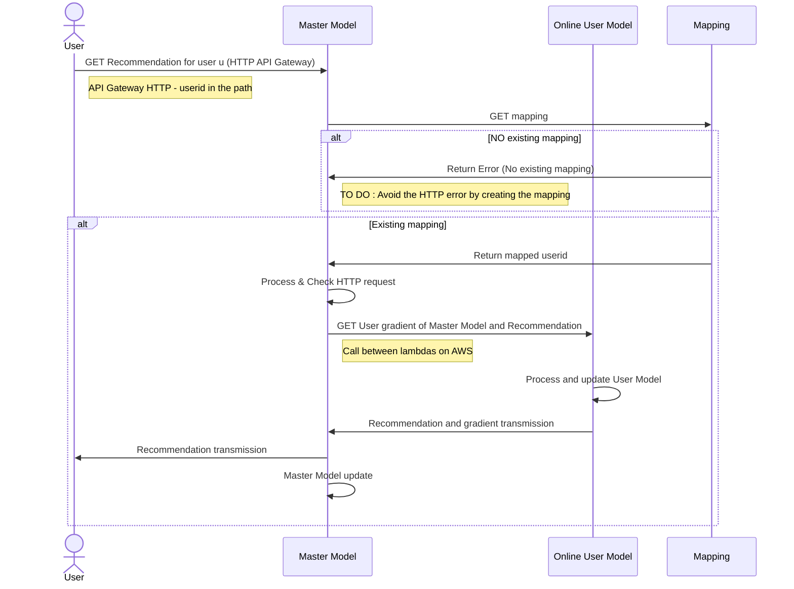
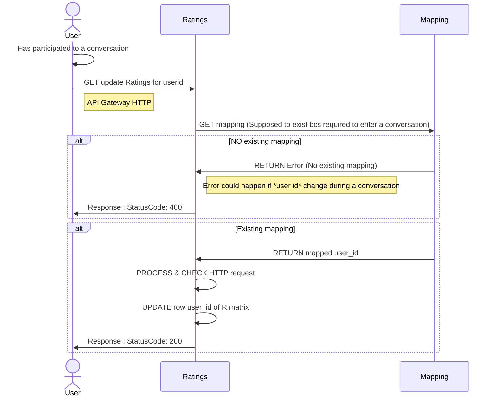
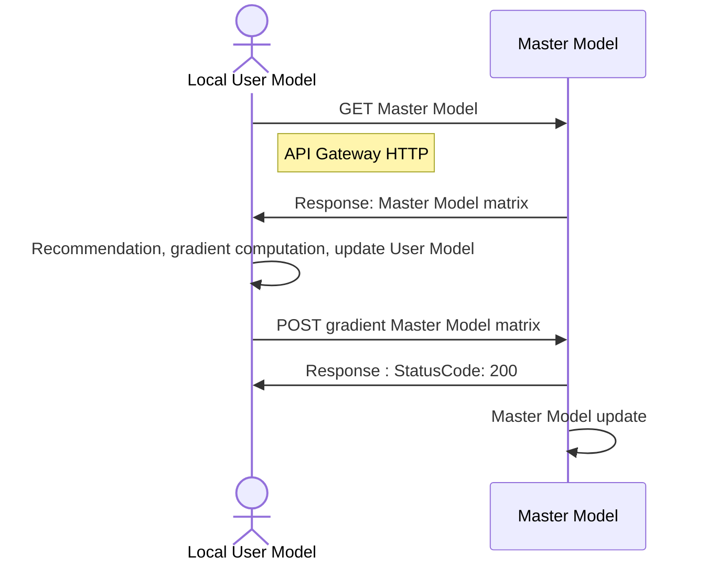

# Recommender system

## Introduction
We want to:
- Assign people to conversation groups. The challenge is to match them with people they will like while not matching them always with the same people.
- Preserve the privacy of the users  
To fulfill these objectives, we will implement an machine learning algorithm[^model0] working with local user data, and without transmitting it to a server.

# Local information available
Locally each user has access to, at a given time:
- Its ID
- The IDs of the users he is talking to.
- The messages that are exchanged in the curent conversations he is involved in.

# Structure of the Machine Learning Algorithm:
# Actual-Online sequence diagrams
## To get a recommendation list


## To update the rating matrix

# Future-Local sequence diagrams
## Desired-Local and Privacy preserving sequence diagram



# AWS Setup:
We use Python with NumPy in an AWS Lambda function. NumPy is not available in the Python AWS default environment. The only solution proposed in the AWS documentation that we succeded to implement was to create a dockerized environnement.

## Container setup with Docker for Python[^cont0][^cont1]
1. On your local machine, create a project directory for your new function (here *recommerder-system*).
2. In your project directory, add a file named `app.py` containing your function code, within a handler function. Example:
```
import numpy

def handler(event, context):
    return np.zeros((10,10))
```

3. In your project directory, add a file named `requirements.txt`. List each required library as a separate line in this file.
4. Create a Dockerfile:  
(Install dependencies under the `${LAMBDA_TASK_ROOT}` directory alongside the function handler to ensure that the Lambda runtime can locate them when the function is invoked.)
```
FROM public.ecr.aws/lambda/python:3.9

# Copy function code
COPY app.py ${LAMBDA_TASK_ROOT}

# Install the function's dependencies using file requirements.txt
# from your project folder.

COPY requirements.txt  .
RUN  pip3 install -r requirements.txt --target "${LAMBDA_TASK_ROOT}"

# Set the CMD to your handler (could also be done as a parameter override outside of the Dockerfile)
CMD [ "app.handler" ]
```

5. Create an Amazon ECR repository using the AWS Console (easier). Copy the corresponding URI.

6. Authenticate the Docker CLI to your Amazon ECR registry.  
```
aws ecr get-login-password --region eu-west-3 | docker login --username AWS --password-stdin 123456789012.dkr.ecr.eu-west-3.amazonaws.com
```

7. Build your Docker image with:
```
docker build -t 123456789012.dkr.ecr.us-east-1.amazonaws.com/hello-world:latest
```
8. Push it in the ECR with 
```
docker push 123456789012.dkr.ecr.us-east-1.amazonaws.com/hello-world:latest
```

ATTENTION : To be in the same folder than the Dockerfile while building is required!

## Create a Database with DynamoDB

1. Create a table:
    - Primary key partitioning type: `chain`
    - Primary key partitioning name: `user_id`
2. Possibly create elements within the table if needed
3. Get the ARN (to connect to the Lambda function[^cloud0])


## Setup a Lambda
### Create a Lambda

1. Container image (Use URI of the container)
2. Create an HTTP API Gateway.
3. Manage the IAM (Configuration--> Authorization) to allow the Lambda to access differents services (For instance a DynamoDB[^cloud0] with Get and Put Methods)

### To configure the HTTP API
No special configuration for the API Gateway HTTP.  

Call : `api_endpoint?userid=çamarche&maman=kklm`  
(ex: `.../hello-world?user_id=2&tomato=abcd&potato=1234`)  

To get the input parameters:
``` 
from urllib import parse
def handler(event, context):
    url_parsed = parse.parse_qs(event["rawQueryString"])
    # Return {'user_id': ['2'], 'tomato':['abcd'], 'potato': ['1234']}
```

### To use a Lambda from another Lambda[^cloud1]
1. Create the second Lambda
2. Manage the IAM of the first Lambda to access the second:  
In the AWS Console Interface of Lambda: --> Configuration --> Permissions --> Execution Role (click, IAM page will open). --> Add permissions --> Create Inline Policy :
    - Service: Lambda
    - Actions: InvokeFunction, InvokeAsync
    - Resource: ARN of the targeted Lambda
3. To test the connexion, put in the handler function:
```
import boto3
# Define the client to interact with AWS Lambda
client_lambda = boto3.client('lambda')
# Define the input parameters that will be passed on to the model x function
inputParams = {"user_id" : user_id,
                "tomato": tomato,
                "potato" : potato
                }

response = client_lambda.invoke(
    FunctionName = 'arn:aws:lambda:eu-west-3:000000000000:function:hello-world-2',
    InvocationType = 'RequestResponse',
    Payload = json.dumps(inputParams))
response_from_child = json.load(response['Payload'])
output = responseFromChild['output_2']
```

### Define environment variable
For instance, to not write Lambda ARNs in the code, you can define it as an envrionment variable:  
1. Define it with the AWS Console Interface: Lambda --> Configuration --> Environment variables
2. Get it in the code with:
```
import os
ARN_LAMBDA_X = os.environ.get('ARN_LAMBDA_X')
```

## References
### Cloud:
[^cloud0]: [Use of DynamoDB tables in the lambda function](https://boto3.amazonaws.com/v1/documentation/api/latest/guide/dynamodb.html)  
[^cloud1]: [Calling an AWS Lambda function from another Lambda function](https://www.sqlshack.com/calling-an-aws-lambda-function-from-another-lambda-function/)

### Container:
[^cont0]: [Deploy Python Lambda functions with container images](https://docs.aws.amazon.com/lambda/latest/dg/images-create.html#images-create-from-base)  
[^cont1]: [Deploy Python Lambda functions with container images-2](https://docs.aws.amazon.com/lambda/latest/dg/python-image.html#python-image-base)

### Model papers:
[^model0]: [Federated Collaborative Filtering for Privacy-Preserving Personalized Recommendation System](https://arxiv.org/abs/1901.09888)