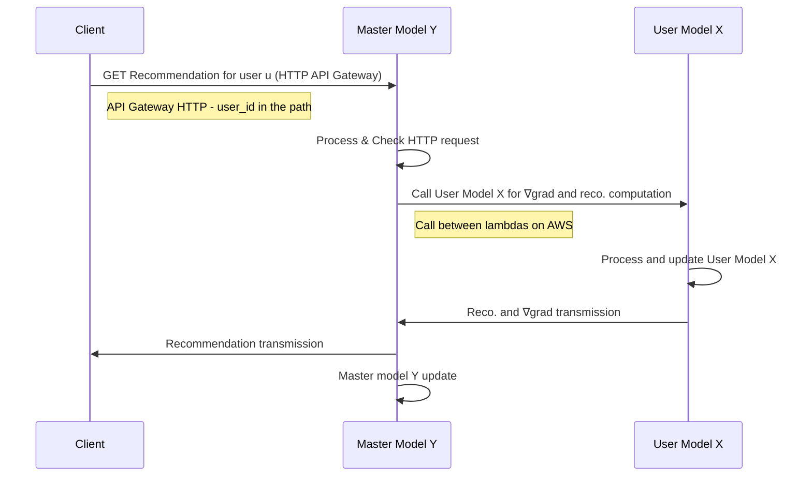
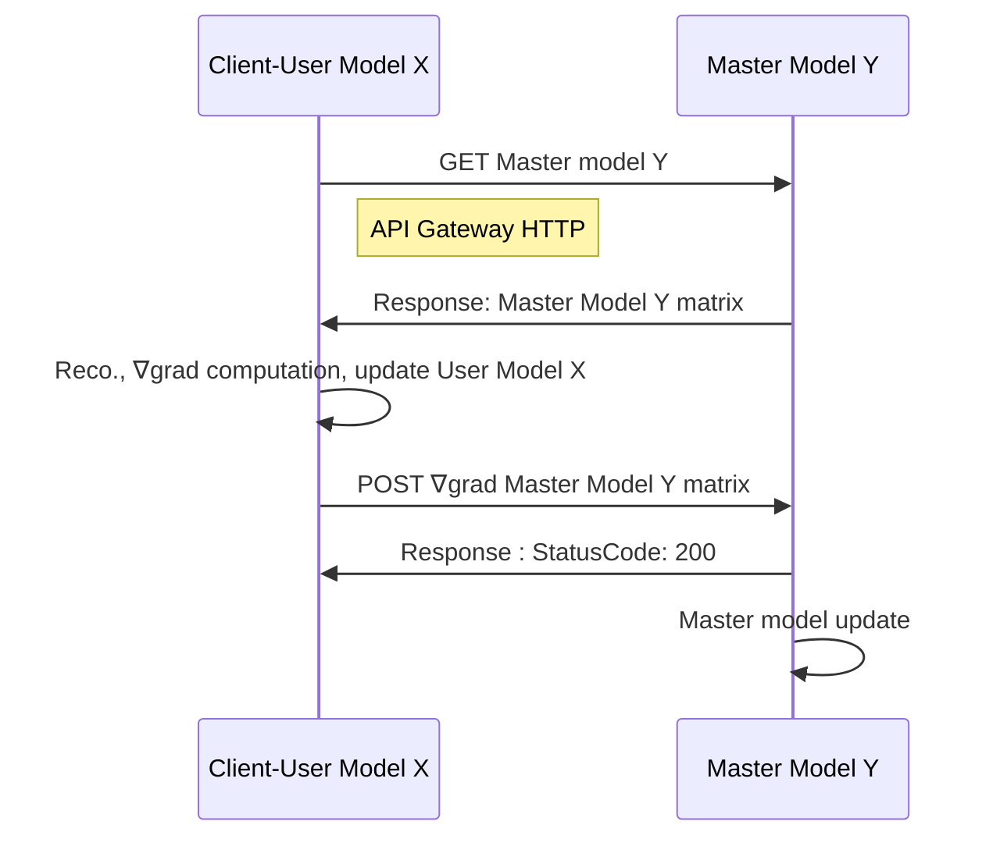

# Recommender system

# AWS Setup:
We want to use Python and the NumPy module in an AWS Lambda function. NumPy is not available in the Python AWS default envrionment. Hence, the only working solution found was to create a dockerized environnement.

## Container setup with Docker for Python
1. On your local machine, create a project directory for your new function (here *recommerder-system*).
2. In your project directory, add a file named `app.py` containing your function code, within a handler function. Example:
```
import numpy

def handler(event, context):
    return np.zeros((10,10))
```

3. In your project directory, add a file named `requirements.txt`. List each required library as a separate line in this file.
4. Create a Dockerfile:  
(Install dependencies under the `${LAMBDA_TASK_ROOT}` directory alongside the function handler to ensure that the Lambda runtime can locate them when the function is invoked.)
```
FROM public.ecr.aws/lambda/python:3.9

# Copy function code
COPY app.py ${LAMBDA_TASK_ROOT}

# Install the function's dependencies using file requirements.txt
# from your project folder.

COPY requirements.txt  .
RUN  pip3 install -r requirements.txt --target "${LAMBDA_TASK_ROOT}"

# Set the CMD to your handler (could also be done as a parameter override outside of the Dockerfile)
CMD [ "app.handler" ]
```

5. Create an Amazon ECR repository. Use the AWS Console (easier). Copy the corresponding URI.

6. Authenticate the Docker CLI to your Amazon ECR registry.  
`aws ecr get-login-password --region eu-west-3 | docker login --username AWS --password-stdin 123456789012.dkr.ecr.eu-west-3.amazonaws.com`

6. Build your Docker image with  
`docker build -t 123456789012.dkr.ecr.us-east-1.amazonaws.com/hello-world:latest` 
7. Push it with  
`docker push 123456789012.dkr.ecr.us-east-1.amazonaws.com/hello-world:latest`


8. Tag your image to match your repository name, and deploy the image to Amazon ECR using the docker push command.  
`docker tag  hello-world:latest 123456789012.dkr.ecr.us-east-1.amazonaws.com/hello-world:latest`  
`docker push 123456789012.dkr.ecr.us-east-1.amazonaws.com/hello-world:latest`

ATTENTION : To be in the right folder of the Dockerfile while building is required!

## Create a Database with DynamoDB

1. Create a table:
    - Key partitioning: `chain`
2. Possibly create elements within the table if needed
3. Get the ARN (to connect to the Lambda function)


## Setup a Lambda
### Create a Lambda

1. Conteneur image (Use URL of the conteneur)
2. Create an HTTP API Gateway.
3. Manage the IAM (Configuration--> Authorization) to allow the Lambda to access the DynamoDB (Get, Put Method for example)

### To configure the HTTP API
No special configuration for the API Gateway HTTP.  
Call : `api_endpoint?userid=çamarche&maman=kklm`  
(ex: `.../hello-world?user_id=2&tomato=abcd&potato=1234)  

To get the input parameters:
``` 
from urllib import parse
def handler(event, context):
    url_parsed = parse.parse_qs(event["rawQueryString"])
    # Return {'user_id': ['2'], 'tomato':['abcd'], 'potato': ['1234']}
```

### To use a Lambda from another Lambda
1. Create the second Lambda
2. Manage the IAM of the first Lambda to access the second:  
In the AWS Console Interface of Lambda: --> Configuration --> Permissions --> Execution Role (click, IAM page will open). --> Add permissions --> Create Inline Policy :
    - Service: Lambda
    - Actions: InvokeFunction, InvokeAsync
    - Resource: ARN of the targeted Lambda
3. To test the connexion, put in the handler function:
```
import boto3
# Define the client to interact with AWS Lambda
client_lambda = boto3.client('lambda')
# Define the input parameters that will be passed on to the model x function
inputParams = {"user_id" : user_id,
                "tomato": tomato,
                "potato" : potato
                }

response = client_lambda.invoke(
    FunctionName = 'arn:aws:lambda:eu-west-3:000000000000:function:hello-world-2',
    InvocationType = 'RequestResponse',
    Payload = json.dumps(inputParams))
response_from_child = json.load(response['Payload'])
output = responseFromChild["output_2"]
```

### Define environment variable
For instance : **The second lambda ARN must not be in the code**. To define it as an envrionment variable:
1. Define it with the AWS Console Interface: Lambda --> Configuration --> Environment variables
2. Get it in the code with:
```
import os
ARN_LAMBDA_X = os.environ.get('ARN_LAMBDA_X')
```


## Actual sequence diagram


## Desired sequence diagram



### References
#### Code :
[0] : [Use of DynamoDB tables in the lambda function](https://boto3.amazonaws.com/v1/documentation/api/latest/guide/dynamodb.html)  
[1] : [Calling an AWS Lambda function from another Lambda function](https://www.sqlshack.com/calling-an-aws-lambda-function-from-another-lambda-function/)

#### Container :
[0] : [Deploy Python Lambda functions with container images](https://docs.aws.amazon.com/lambda/latest/dg/images-create.html#images-create-from-base)
[1] : [Deploy Python Lambda functions with container images](https://docs.aws.amazon.com/lambda/latest/dg/python-image.html#python-image-base)

### Models 
[0] : [Federated Collaborative Filtering for Privacy-Preserving Personalized Recommendation System](https://arxiv.org/abs/1901.09888)

