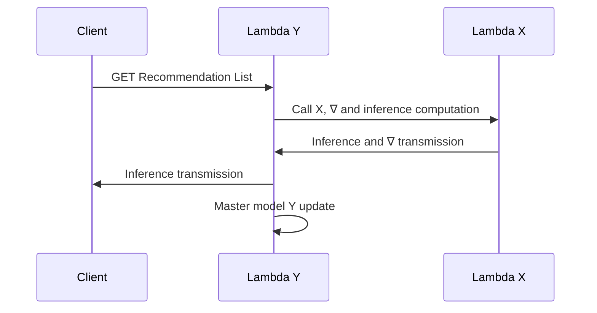

# Recommender system

## AWS Setup:
We want to use Python and the NumPy module in an AWS Lambda function. In this objective, the only solution found was to create a dockerized environnement.

### Container setup with Docker for Python
1. On your local machine, create a project directory for your new function.
2. In your project directory, add a file named app.py containing your function code, then add your function handler code to the app.py function. Example 
```
import numpy

def handler(event, context):
    return np.zeros((10,10))
    
```

3. In your project directory, add a file named requirements.txt. List each required library as a separate line in this file.
4. Create a Dockerfile like so:  
Install any dependencies under the ${LAMBDA_TASK_ROOT} directory alongside the function handler to ensure that the Lambda runtime can locate them when the function is invoked.
```
FROM public.ecr.aws/lambda/python:3.9

# Copy function code
COPY app.py ${LAMBDA_TASK_ROOT}

# Install the function's dependencies using file requirements.txt
# from your project folder.

COPY requirements.txt  .
RUN  pip3 install -r requirements.txt --target "${LAMBDA_TASK_ROOT}"

# Set the CMD to your handler (could also be done as a parameter override outside of the Dockerfile)
CMD [ "app.handler" ]
```

5. Create an Amazon ECR

6. Build your Docker image with `docker build -t hello-world .`
7. Authenticate the Docker CLI to your Amazon ECR registry.  
`aws ecr get-login-password --region us-east-1 | docker login --username AWS --password-stdin 123456789012.dkr.ecr.us-east-1.amazonaws.com`

8. Create a repository in Amazon ECR directly with the ECR interface (easier).

9. Tag your image to match your repository name, and deploy the image to Amazon ECR using the docker push command.  
`docker tag  hello-world:latest 123456789012.dkr.ecr.us-east-1.amazonaws.com/hello-world:latest`  
`docker push 123456789012.dkr.ecr.us-east-1.amazonaws.com/hello-world:latest`

10. To update the version :  
`docker build -t 123456789012.dkr.ecr.us-east-1.amazonaws.com/hello-world:latest`  
`docker push 123456789012.dkr.ecr.us-east-1.amazonaws.com/hello-world:latest`

### Create a Database with DynamoDB

1. Create a table:
    - Key partitioning: Chain
2. Possibly create elements within the table if required
3. Get the ARN (required to connect to the Lambda function)

### Create a Lambda

1. Conteneur image (Using URL of the conteneur)
2. Create an API Gateway
3. Manage the IAM (Configuration--> Authorization) to allow the Lambda to access the DynamoDB (Get, Put Method for example)

### To use a Lambda within another Lambda
1. Create the second Lambda
2. Manage the IAM of the first Lambda to access the second (InvokeFunction, InvokeAsync)
3. Test the connexion with this kind of code :
```        
# Define the client to interact with AWS Lambda
client_lambda = boto3.client('lambda')
# Define the input parameters that will be passed on to the model x function
inputParams = {"user_id" : user_id,
                "model_inference": model_inference,
                "user_creation" : user_creation
                }

response = client_lambda.invoke(
    FunctionName = 'arn:aws:lambda:eu-west-3:010661011891:function:awa-get-recommender-system-temporary',
    InvocationType = 'RequestResponse',
    Payload = json.dumps(inputParams))

responseFromChild = json.load(response['Payload'])
user_id_x = responseFromChild["user_id"]
inference_x = responseFromChild['inference_x']
```


## Actual sequence diagram


## Desired sequence diagram
```mermaid
sequenceDiagram
      participant Client as Client-X
      participant Model as Lambda Y
      Client ->> Model: GET Master model Y
      Model ->> Client: Response: Y matrix
      Client ->> Client: Inference and ∇ computation
      Client ->> Model: POST ∇ Y
      Model ->> Client: Response: 200
      Model ->> Model: Master model Y update


### References
#### Code :
[0] : [Use of DynamoDB tables in the lambda function](https://boto3.amazonaws.com/v1/documentation/api/latest/guide/dynamodb.html)  
[1] : [Calling an AWS Lambda function from another Lambda function](https://www.sqlshack.com/calling-an-aws-lambda-function-from-another-lambda-function/)


```


#### Container :


[0] : [Deploy Python Lambda functions with container images](https://docs.aws.amazon.com/lambda/latest/dg/images-create.html#images-create-from-base)

[1] : [Deploy Python Lambda functions with container images](https://docs.aws.amazon.com/lambda/latest/dg/python-image.html#python-image-base)

#### Calling A Lambda with another Lambda:

[0] : [Calling an AWS Lambda function from another Lambda function](https://www.sqlshack.com/calling-an-aws-lambda-function-from-another-lambda-function/)

